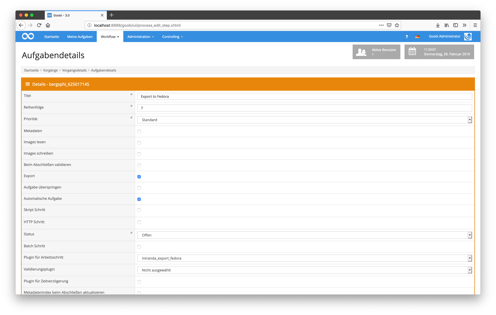
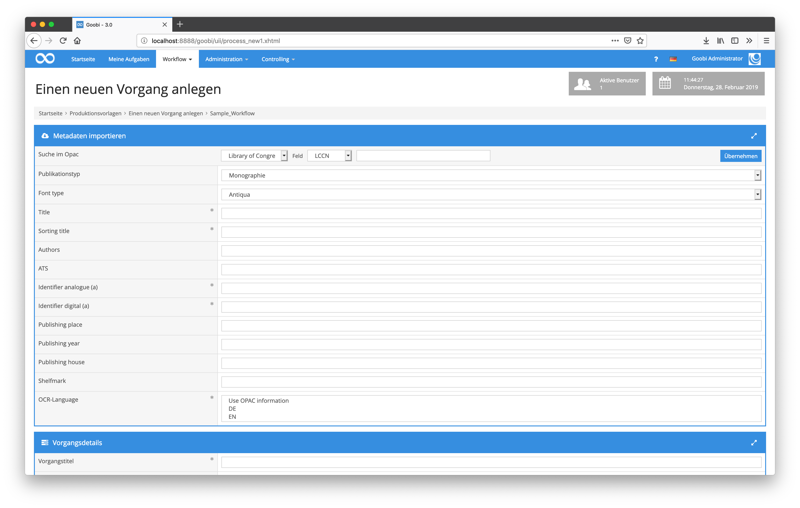
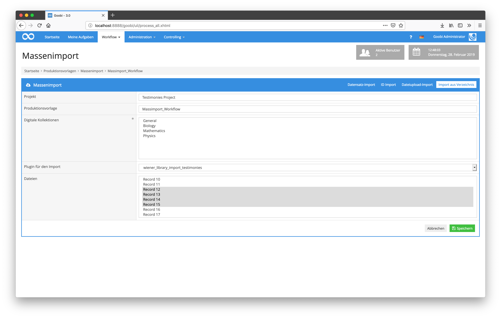
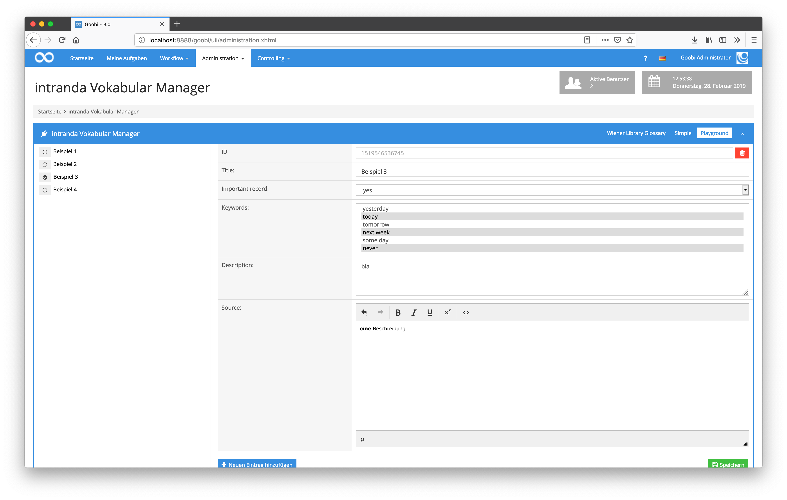
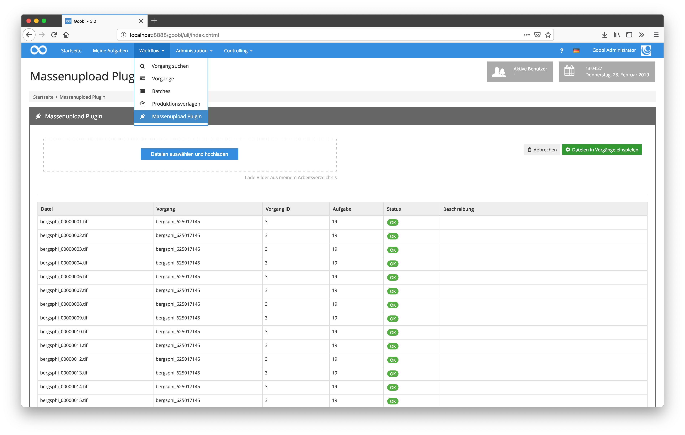
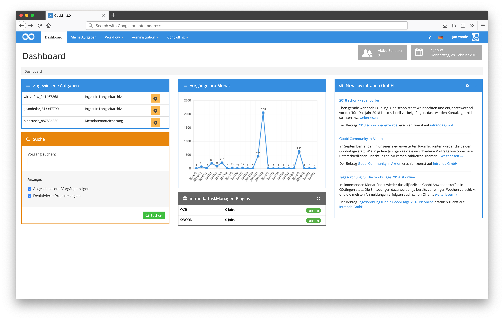
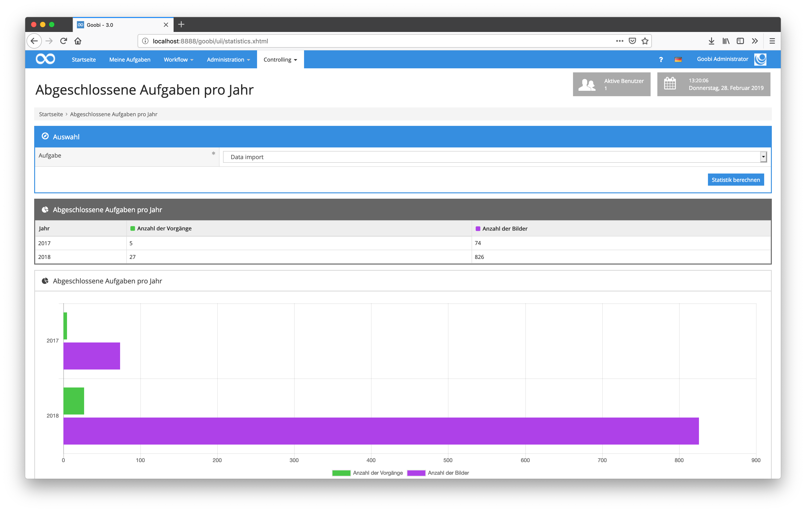

# Übersicht

Auf den folgenden Seiten finden Sie die einzelnen zumeist kleineren Dokumentationen für verschiedene Plugins und Erweiterungen für Goobi workflow. Bitte wählen Sie zunächst im linken Bereich innerhalb des Inhaltsverzeichnisses das gewünschte Plugin aus, um zu Dokumentation zu gelangen.

Bitte beachten Sie, dass es innerhalb von Goobi workflow verschiedene Arten von Plugins für die jeweiligen Anwendungsszenarien gibt:

## Export Plugins

Export Plugins dienen für den Export von Daten aus Goobi workflow zu einem anderen System. Sie werden entweder automatisch im Rahmen des Workflows ausgeführt oder durch einen manuellen Klick auf das entsprechende Icon in der Vorgangsliste. Installiert werden sie üblicherweise innerhalb dieses Pfades:

```text
/opt/digiverso/goobi/plugins/export/
```

Die Einrichtung von Export Plugins innerhalb von Goobi erfolgt so, dass sie innerhalb eine Workflows für einen Arbeitsschritt aus der Liste der Step-Plugins ausgewählt werden und zusätzliche die Checkbox `Export` aktiviert wird. Üblicherweise wird ausserdem auch die Checkbox `Automatische Aufgabe` mit ausgewählt, um die Exporte automatisch in Verlauf des Workflows ausführen zu lassen.



Manche Export Plugins verfügen über eine eigene Konfigurationsdatei. Diese ist im allgemeinen so benannt wie das Plugin selbst und befindet sich üblicherweise unter folgendem Pfad:

```text
/opt/digiverso/goobi/config/
```

## Step Plugins

Step Plugins dienen für eine Erweiterung von Aufgaben innerhalb des Goobi Workflows. Mit solchen Plugins läßt sich beispielsweise eine individuelle Funktionalität in den Workflow integrieren, die Goobi nicht out-of-the-box mitbringt. Beispiele für solche Plugins sind unter anderem besondere Konvertierungsplugins, Erfassungsmasken, Bildmanipulationen etc.

Installiert werden solche Step Plugins in den Ordner:

```text
/opt/digiverso/goobi/plugins/step/
```

Verfügt ein Plugin neben der eigentlichen Funktionalität ausserdem über eine Nutzeroberfläche, so muss der Teil der Nutzeroberfläche zusätzlich in diesen Ordner installiert werden:

```text
/opt/digiverso/goobi/plugins/GUI/
```

Grundsätzlich werden Step Plugins in Goobi so eingerichtet, dass diese innerhalb einer Aufgabe als Plugin ausgewählt werden.


Zu beachten ist noch, dass es innerhalb von Step Plugins derzeit drei unterschiedliche Typen gibt:

| Typ | Beschreibung |
| :--- | :--- |
| **No GUI** | Das Plugin bringt keine eigene Nutzeroberfläche mit und wird serverseitig im Hintergrund ausgeführt. Beispiel: Ein Plugin für die automatische Konvertierung von Bildern in ein anderes Dateiformat. |
| **Part GUI** | Das Plugin bringt einen Teil für eine Nutzeroberläche mit und wird innerhalb einer bearbeiteten Aufgabe optisch so integriert als wäre es Teil des Goobi Kerns. Hier kann der Nutzer mit der Nutzeroberfläche interagieren. Beispiel: Ein Plugin für den Upload von Bildern innerhalb einer Aufgabe. |
| **Full GUI** | Das Plugin bringt eine vollständige Nutzeroberfläche mit. Diese ist nicht unmittelbar in die Aufgabe integriert. Stattdessen wirde dem Nutzer ein Button angeboten, um das Plugin betreten zu können, so dass er dann darin mit dem Plugin interagieren kann. Beispiel: Plugin für die Bildkontrolle. |


Manche Step Plugins verfügen über eine eigene Konfigurationsdatei. Diese ist im allgemeinen so benannt wie das Plugin selbst und befindet sich üblicherweise unter folgendem Pfad:

```text
/opt/digiverso/goobi/config/
```

## Opac Plugins

Opac Plugins dienen zur Kommunikation mit externen Datenquellen. Typische Beispiele hierfür sind Plugins für die Anbindung von Bibliothektskatalogen oder Datenbanken. Hierfür existieren je nach Datenquelle verschiedene Implementierungen, um die jeweilig zu verwendende Schnittstelle korrekt anzusprechen.

Opac Plugins werden üblicherweise in diesen Pfad installiert:

```text
/opt/digiverso/goobi/plugins/opac/
```

Nach der Installation eines solchen Plugins steht es innerhalb der Anlegemaske für Vorgänge in Goobi in dem Feld `Suche im Opac` zur Verfügung.



## Import Plugins

Import Plugins dienen für die Ausführung von größeren Massenimporten. Anders als bei Opac Plugins wird hier nicht Vorgang für Vorgang aus einer Datenquelle abgefragt. Stattdessen werden bei den Import Plugins die Daten meist zugleich für hunderte oder tausende Daten übernommen, die oft in unterschiedlichsten Formaten vorliegen. Gängige Beispiele sind hier unter anderem Import Plugins für das Einspielen von SQL-Dumps, Excel-Tabellen oder sonstigen proprietären Datenquellen.

Die Installation der Import Plugins erfolgt im Ordner:

```text
/opt/digiverso/goobi/plugins/import/
```

Der Einsatz dieser Plugins erfolgt in einer eigenen Maske für Massenimporte, in der man den unterschiedlichen Importmechanismus sowie das gewünschte Plugin auswählt, bevor anschließend eine Auswahl der Daten erfolgt.



Einige Import Plugins verfügen über eine eigene Konfigurationsdatei. Diese ist im allgemeinen so benannt wie das Plugin selbst und befindet sich üblicherweise unter folgendem Pfad:

```text
/opt/digiverso/goobi/config/
```

## Administration Plugins

Für einige besondere Anwendungsfälle stehen Administration Plugins bereit. Die Besonderheit dabei ist, dass diese Plugins funktionell nicht eingeschränkt sind. Sie sind nicht explizit an einer vorgegebenen Stelle innerhalb des Workflows integriert noch werden sie zu einem definierten Moment ausgeführt. Stattdessen bieten sie zumeist eine eigenen Nutzeroberfläche und bieten eine eigenständige Funktionalität als Erweiterung von Goobi an. Beispiele hierfür sind unter anderem administrative Eingriffe in mehrere Vorgangsdaten oder auch die Verwaltung von kontrollierten Vokabularen.

Die Installation der Administration Plugins erfolgt im Ordner:

```text
/opt/digiverso/goobi/plugins/administration/
```

Da die meisten Administration Plugins neben der eigentlichen Funktionalität ausserdem über eine Nutzeroberfläche verfügen, so muss diese zusätzlich in folgenden Ordner installiert werden:

```text
/opt/digiverso/goobi/plugins/GUI/
```



Manche Administration Plugins verfügen über eine eigene Konfigurationsdatei. Diese ist im allgemeinen so benannt wie das Plugin selbst und befindet sich üblicherweise unter folgendem Pfad:

```text
/opt/digiverso/goobi/config/
```

## Workflow Plugins

Die Workflow Plugins sind technisch sehr ähnlich zu den Administration Plugins. Auch sie können eine eigenständige Nutzeroberfläche für die Bereitstellung zusätzlicher Funktionalität anbieten. Im Gegensatz zu den Adminstration Plugins ist der Zugriff auf diese Plugins jedoch auch ohne administrative Rechte innerhalb von Goobi möglich, so dass üblicherweise ein größerer Benutzerkreis Zugriff auf diese Funktionen erhält.

Die Installation der Workflow Plugins erfolgt im Ordner:

```text
/opt/digiverso/goobi/plugins/workflow/
```

Da die meisten Workflow Plugins neben der eigentlichen Funktionalität ausserdem über eine Nutzeroberfläche verfügen, so muss diese zusätzlich in folgenden Ordner installiert werden: 

```text
/opt/digiverso/goobi/plugins/GUI/
```



Manche Administration Plugins verfügen über eine eigene Konfigurationsdatei. Diese ist im allgemeinen so benannt wie das Plugin selbst und befindet sich üblicherweise unter folgendem Pfad:

```text
/opt/digiverso/goobi/config/
```

## Dashboard Plugins

Mit den Dashboard Plugins besteht die Möglichkeit, dass statt der Standardstartseite ein besonderes Dashboard mit zusätzlicher Funktionalität bereitgestellt wird. Diese könnte beispielsweise bereits einige statistische Informationen anzeigen, die integration mit anderen Systemen aufzeigen und auch einen Einblick in das aktuelle Monitoring geben.

Die Installation der Dashboard Plugins erfolgt im Ordner:

```text
/opt/digiverso/goobi/plugins/dashboard/
```

Die Nutzeroberfläche der Dashboards muss diese zusätzlich in folgenden Ordner installiert werden:

```text
/opt/digiverso/goobi/plugins/GUI/
```



Einige Dashboard Plugins verfügen über eine eigene Konfigurationsdatei. Diese ist im allgemeinen so benannt wie das Plugin selbst und befindet sich üblicherweise unter folgendem Pfad:

```text
/opt/digiverso/goobi/config/
```

Außerdem ist zu beachten, dass individuelle Dashboards stets innerhalb der Hauptkonfigurationsdatei `goobi_config.properties` aktiviert werden müssen. Dies erfolgt beispielsweise wie folgt:

```text
dashboardPlugin=intranda_dashboard_extended
```

## Statistik Plugins

Zur Bereitstellung individueller Statistiken stehen die Statistik Plugins zur Verfügung. Abhängig davon, welche dieser Plugins installiert sind, können so verschiedenste Statistische Auswertungen erfolgen, die entweder als Diagramme, als Tabellen oder auch als Download in verschiedenen Formaten erfolgen können.

Die Installation der Statistik Plugins erfolgt im Ordner:

```text
/opt/digiverso/goobi/plugins/statistics/
```

Die Nutzeroberfläche der Dashboards muss diese zusätzlich in folgenden Ordner installiert werden:

```text
/opt/digiverso/goobi/plugins/GUI/
```



## Validation Plugins

Die Validation Plugins dienen in Goobi dafür, dass vor Abschluß eines Arbeitsschrittes zunächst sichergestellt wird, dass Daten so vorliegen wie gewünscht. Ist die Durchführung der Validierung nicht erfolgreich, so kann der Nutzer die Aufgabe nicht abschließen und somit auch nicht aus seiner Aufgabenliste entfernen.

Die Installation der Validation Plugins erfolgt im Ordner:

```text
/opt/digiverso/goobi/plugins/validation/
```

Anschließend muss für den gewünschten Arbeitsschritt das Validierungsplugin innerhalb der Aufgabe im Feld `Validierungsplugin` entsprechend ausgewählt werden.


Einige Validation Plugins verfügen über eine eigene Konfigurationsdatei. Diese ist im allgemeinen so benannt wie das Plugin selbst und befindet sich üblicherweise unter folgendem Pfad:

```text
/opt/digiverso/goobi/config/
```

## Web-API Plugins

Für die Kommunikation externer Systeme mit Goobi bietet Goobi eine Web-API an, für die individuelle Plugins bereitstehen. So lassen sich beispielsweise durch externe Systeme Meldungen zum Vorgangslog eines Vorgangs senden, Aufgaben abschließen, Informationen zum Status abfragen und vieles mehr.

Die Installation von Web-API Plugins erfolgt in folgendem Ordner:

```text
/opt/digiverso/goobi/plugins/command/
```

Web-API Plugins verfügen grundsätzlich nicht über eine eigene Nutzeroberfläche und dienen nur für die Kommunikation mittels HTTP-Aufrufen.


Zu beachten ist, dass für jedes Kommando ein Zugriff individuell festgelegt werden kann. Dies erfolgt über die folgende Konfigurationsdatei:

```text
/opt/digiverso/goobi/config/goobi_webapi.xml
```

Darin kann festgelegt werden, aus welchem IP-Bereich ein Zugriff für welches Kommando erlaubt ist.

## REST Plugins

Mittels der REST Plugins verfügt Goobi über eine weitere Möglichkeit, dass externe Systeme mit Goobi kommunizieren. Im Gegensatz zur Web-API erfolgt hier die Kommunikation allerdings über REST und findet größtenteils über JSON statt.

Die Installation von REST Plugins erfolgt in folgendem Ordner:

```text
/opt/digiverso/goobi/plugins/rest/
```

Ebenso wie die Web-API Plugins verfügen auch die REST Plugins über keine eigene Nutzeroberfläche. Auch wird die Berechtigung für den Zugriff über die gleiche Konfigurationsdatei gesteuert und kontrolliert damit den Zugriff von ausgewählten IP-Adressen und unter Prüfung einer Authentifizierung. Auch für die REST Plugins erfolgt die Konfiguration dabei in folgender Datei:

```text
/opt/digiverso/goobi/config/goobi_webapi.xml
```

