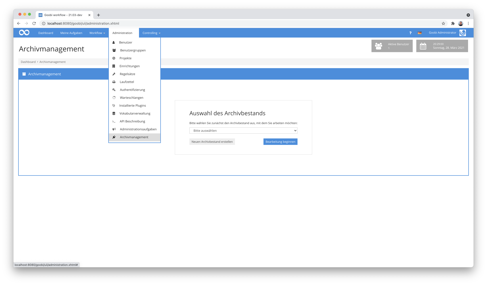
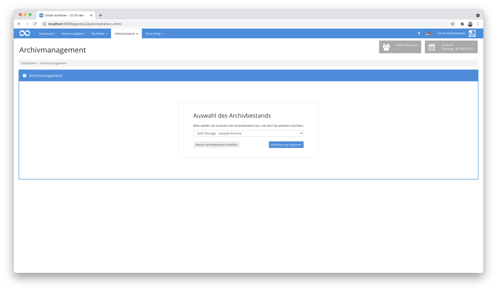
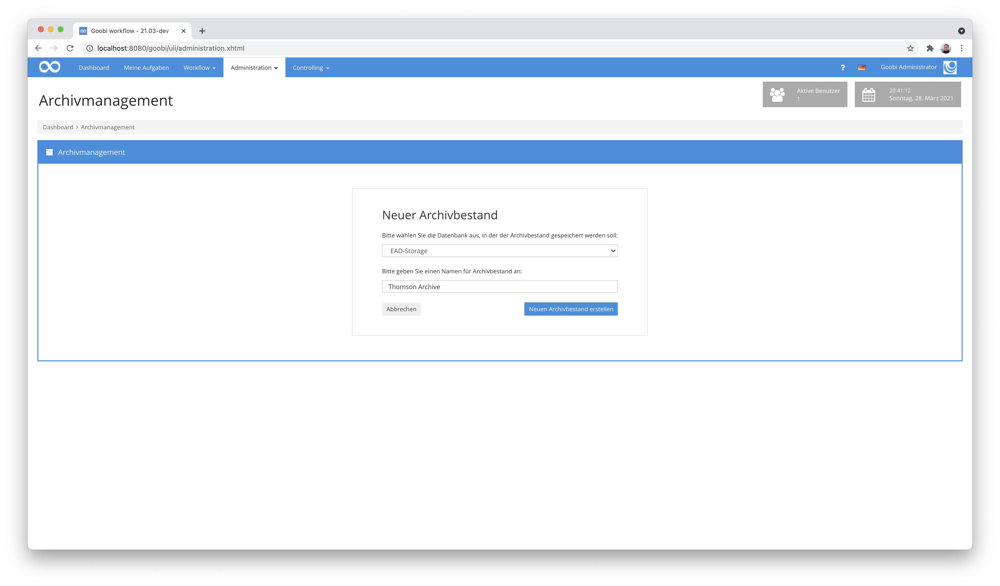
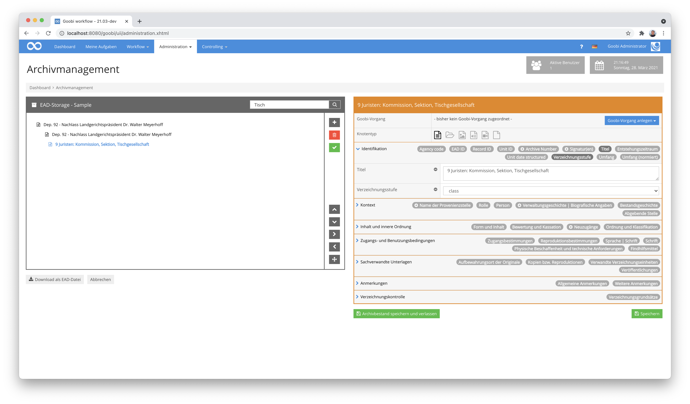
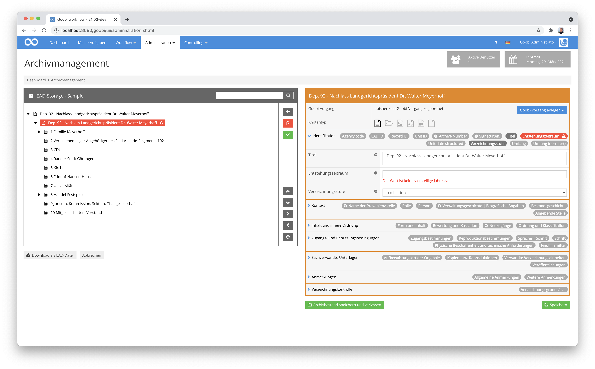

# Archive Management

## Einführung

Die vorliegende Dokumentation beschreibt die Installation, die Konfiguration und den Einsatz des Administration Plugins für die Verwaltung von Archivbeständen aus Goobi workflow heraus. Dabei werden die Daten mehrerer Bestände innerhalb von standardisierten EAD-Dateien gespeichert und erlauben auch kleinen Archiven eine standardisierte Datenerfassung ohne Inbetriebnahme einer kostenpflichtigen Drittsoftware.

| Details |  |
| :--- | :--- |
| Identifier | intranda\_administration\_archive\_management |
| Source code | [https://github.com/intranda/goobi-plugin-administration-archive-management](https://github.com/intranda/goobi-plugin-administration-archive-management) |
| Lizenz | GPL 2.0 oder neuer |
| Kompatibilität | Goobi workflow 2020.12 |
| Dokumentationsdatum | 28.03.2021 |

## Installation des Plugins

Das Plugin besteht insgesamt aus den folgenden zu installierenden Dateien

```bash
plugin_intranda_administration_archive_management.jar
plugin_intranda_administration_archive_management-GUI.jar
```

Diese Dateien müssen in den richtigen Verzeichnissen installiert werden, so dass diese nach der Installation in folgenden Pfaden vorliegen:

```bash
/opt/digiverso/goobi/plugins/administration/plugin_intranda_administration_archive_management.jar
/opt/digiverso/goobi/plugins/GUI/plugin_intranda_administration_archive_management-GUI.jar
```

Darüber hinaus benötigt das Plugin noch zusätzlich eine Konfigurationsdatei, die an folgender Stelle liegen muss:

```bash
/opt/digiverso/goobi/config/plugin_intranda_administration_archive_management.xml
```

## Installation der Datenbank BaseX

Das Plugin liest und schreibt standardisierte EAD-Dateien. Damit diese Bearbeitungen der Daten performant erfolgen kann, wird hierzu die XML-Datenbank BaseX verwendet, innerhalb der die EAD-Dateien abgelegt und indiziert werden. Voraussetzung für die Installation von BaseX ist Java 1.8. Die Inbetriebnahme dieser Datenbank erfolgt abhängig von dem Einsatzzweck etwas unterschiedlich, abhängig davon, ob das Plugin für einen Produktivbetrieb oder für die Weiterentwicklung installiert werden soll.





## Konfiguration des Plugins

Nach erfolgter Installation kann die Konfiguration des Plugins und der zugehörigen Oberfäche stattfinden. Diese ist auf der folgenden Seite detailliert beschrieben:



## Nutzung des Plugins innerhalb von Goobi

Das Plugin für die Bearbeitung von Archivbeständen findet sich unterhalb des Menüpunkts `Administration`.



### Zuweisung der benötigen Rechte für die Nutzung des Plugins

Zur Nutzung des Plugins ist zunächst notwendig, dass der Nutzer über das Recht `Plugin_Administration_Archive_Management` verfügt. Sollte dieses Recht noch noch nicht zugewiesen worden sein, erhält der Nutzer folgenden Hinweis:


Die entsprechenden Rechte müssen den jeweiligen Benutzergruppen daher zunächst zugewiesen werden.


Nachdem die benötigten Rechte zugewiesen wurden und ggf. ein neuer Login erfolgte, kann die Nutzung des Plugins erfolgen.

### Auswahl vorhandener EAD Datei

Nachdem das Plugin geöffnet wurde, wird zunächst eine Liste der zur Verfügung stehenden Archivbestände angezeigt. Hier kann der Nutzer einen Archivbestand auswählen und mit der Bearbeitung beginnen.



Alternativ dazu kann ebenfalls ein neuer Archivbestand erzeugt werden. In diesem Fall muss zunächst die gewünschte XML-Datenbank ausgewählt werden, innerhalb der der neue Archivbestand erzeugt werden soll. Auch muss hier ein Name vergeben werden.



Nach der Auswahl des zu bearbeitenden Archivbestandes wird man in die Bearbeitungsmaske weitergeleitet. Hier läßt sich nun im linken Bereich der Strukturbaum bearbeiten. Im rechten Bereich können die Details des jeweils ausgewählten Knoten bearbeitet werden.


Durch einen Klick auf die Buttons `Abrechen` oder `Archivbestand speichern und verlassen` wird man wieder auf die Seite zur Auswahl eines Archivbestandes geleitet.

### Strukturbaum bearbeiten

Im linken Bereich der Bearbeitungsmaske lässt sich die Struktur des Archivbestandes bearbeiten. Hier lassen sich alle Knoten inklusive ihrer Hierarchie auf einen Blick einsehen. Vor jedem Element befindet sich ein Icon, mit dem sich die Unterelemente des Knotens anzeigen oder ausblenden lassen. Um einen Knoten auszuwählen, kann er angeklickt werden. Er wird dann farbig hervorgehoben und die Details des ausgewählten Knotens werden auf der rechten Seite angezeigt. Wenn ein Knoten im linken Bereich der Bearbeitungsmaske ausgewählt wurde, können ausserdem die Buttons am rechten Rand der linken Box genutzt werden, um den Knoten zu ändern. Folgende Optionen sind hierbei möglich:

| Funktion | Erläuterung |
| :--- | :--- |
| `Neuen Knoten einfügen` | Mit diesem Button kann ein neuer Knoten als Unterknoten an das Ende der bereits vorhandenen Unterknoten angefügt werden. |
| `Knoten löschen` | Hiermit läßt sich der ausgewählte Knoten inklusive aller Unterknoten löschen. Diese Funktion kann nicht auf der Ebene des Hauptknotens genutzt werden. |
| `Validierung ausführen` | Mit dieser Funktion läßt sich eine Validierung des ausgewählten Knotens ausführen. Verstöße gegen die konfigurierten Validierungsvorgaben werden entsprechend aufgeführt. |
| `Nach oben bewegen` | Dieser Button erlaubt das Verschieben des ausgewählten Knotens nach oben innerhalb der gleichen Hierarchieebene. |
| `Nach unten bewegen` | Dieser Button erlaubt das Verschieben des ausgewählten Knotens nach unten innerhalb der gleichen Hierarchieebene. |
| `In der Hierarchie nach unten bewegen` | Mit dieserm Button ist es möglich, den ausgewählten Knoten auf eine tiefere Hierarchiestufe zu verschieben. |
| `In der Hierarchie nach oben bewegen` | Mit dieserm Button ist es möglich, den ausgewählten Knoten auf eine höhere Hierarchiestufe zu verschieben. |
| `Knoten an andere Stelle bewegen` | Mit dieser Funktion öffnet sich eine andere Bearbeitungsmaske, die es ermöglicht, den aktuell ausgewählten Knoten an einer ganz andere Stelle des Hierarchiebaums zu verschieben. Hierbei wird die komplette Hierarchie angezeigt, so dass derjenige Knoten ausgewählt werden kann, innerhalb dem der ausgewählte Knoten als Unterknoten eingefügt werden soll. |



Im oberen Bereich der Hierarchieanzeige kann darüber hinaus auch eine Suche innerhalb der Titel der Knoten erfolgen. Dabei werden die gefundenen Knoten samt Hierarchie angezeigt und farbig hervorgehoben. Um die Suche wieder zurückzusetzen genügt es, den Inhalt des Suchbegriffs wieder zu leeren und entsprechen eine leere Suche auszuführen.

### Bearbeitung eines ausgewählten Knotens

Sofern im linken Bereich ein Knoten ausgewählt wurde, werden im rechten Bereich die Details des ausgewählten Knotens angezeigt.

Der rechte Bereich ist dabei in mehrere Kategorien aufgeteilt. Im obersten Teil des rechten Bereichs wird der dazugehörige Goobi-Vorgang angezeigt, sowie eine Möglichkeit zum erzeugen des Laufzettels. Wenn für den Knoten noch kein Goobi-Vorgang erzeugt wurde, kann ein neuer Vorgang auf der Basis der konfigurierten Produktionsvorlage erstellt werden. Als Dokumententyp wird entprechend der Konfiguration der ausgewählte Knotentyp verwendet. Abhängig von der Konfiguration und dem verwendeten Regelsatz stehen bespielsweise folgende Optionen zur Verfügung:

* Folder / Ordner
* File / Akte
* Image / Bild
* Audio
* Video
* Other / Sonstiges

Unterhalb des Dokumententyps werden die einzelnen Metadaten des Knotens aufgelistet. Sie sind gemäß des ISAD\(G\)-Standards in die folgenden Bereiche aufgeteilt:

* Identifikation
* Kontext
* Inhalt und innere Ordnung
* Zugangs- und Benutzungsbedingungen
* Sachverwandte Unterlagen
* Anmerkungen
* Verzeichnungskontrolle

Jeder dieser Bereiche lässt sich einzeln auf- und zuklappen. Auch wenn hierbei ein Bereich zugeklappt ist, läßt sich sehr einfach erkennen, welche Metadaten pro Bereich möglich und welche bereits ausgefüllt sind. Die einzelnen Metadaten werden dabei als verschieden hervorgehobene Badges angezeigt. Ein dunkler Hintergrund zeigt an, dass für diese Metadatum bereits ein Wert erfasst wurde. Ein heller Hintergrund hingeben bedeutet, dass dieses Feld noch ohne Inhalt ist. Sofern ein Feld wiederholbar angelegt werden kann, enthält der Badge ein Plus-Icon.

Wenn die Details eines Bereiches ausgeklappt werden, erfolgt eine Anzeige der einzelnen Metadaten. Standardmäßig werden dabei nur diejenigen Felder angezeigt, die bereits über einen einen Wert verfügen. Weitere Felder lassen sich durch einen Klick auf eines der Badges hinzufügen. Über das Minus-Icon lassen sich Felder wieder entfernen.

### Validierung der Metadaten

Sowohl der Button `Download als EAD Datei` als auch der Button `Validierung ausführen` stellen sicher, dass die Metadaten valide sind. Dabei werden die konfigurierten Regeln angewendet und geprüft, ob einzelne Werte dagegen verstoßen. Ist dies der Fall, werden die betroffenen Knoten im linken Bereich farbig hervorgehoben. Wird ein solcher invalider Knoten ausgewählt, werden die betroffenen Badges rot dargestellt und in den Metadaten wird neben der Umrandung auch der konfigurierte Fehlertext angezeigt.



Eine fehlgeschlagene Validierung verhindert nicht das Speichern des Archivbestandes oder das Erzeugen von Goobi-Vorgängen.

### Download der EAD-Datei und Speichern der Daten

Die beiden Buttons zum `Download als EAD Datei` und `Archivbestand speichern und verlassen` erzeugen eine neue EAD auf Basis des aktuellen Zustandes der Knoten. Dabei wird mit Ausnahme des obersten Knoten jeder Knoten als eigentständiges `<c>`-Element dargestellt. Die Daten des obersten Knoten werden innerhalb von `<archdesc>` unterhalb des `<ead>` Elements geschrieben.

Neben den erfassten Metadaten wird ein neues `create` oder `modified event` samt Datum und Nutzerinformationen erstellt und in der Liste der Events hinzugefügt. Wenn der Archivbestand gespeichert wird, wird der aktuelle Zustand ebenfalls automatisch in die XML-Datenbank exportiert.

