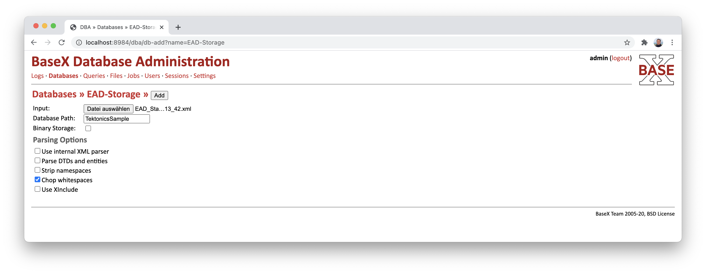
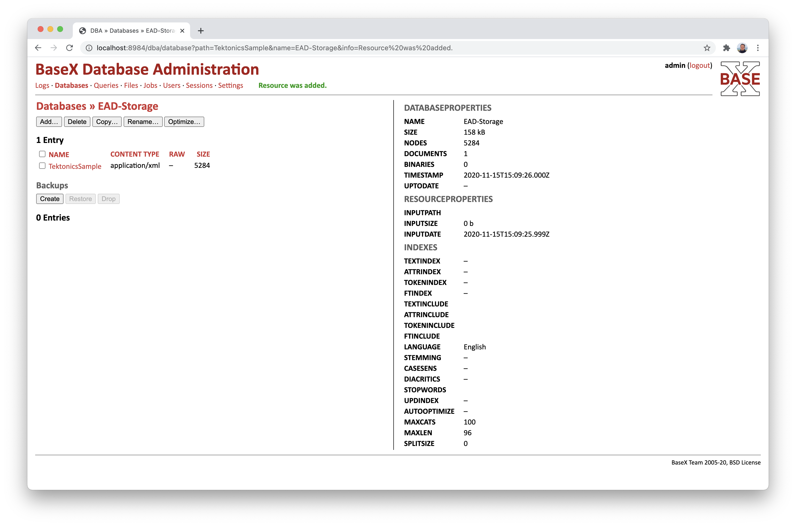
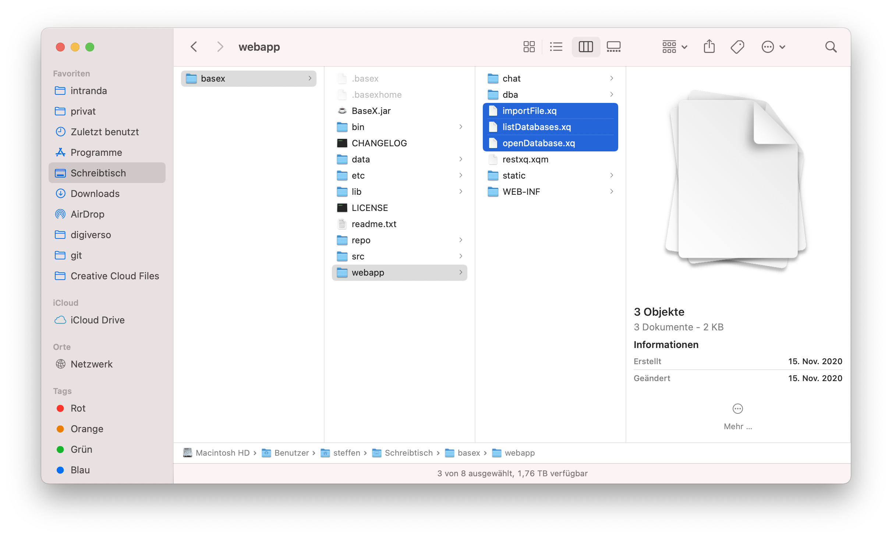

# Installation des Archivmanagement-Plugins für den Produktivbetrieb

Zur Installation des Plugins für den produktiven Einsatz auf einem Webserver gehen Sie folgendermaßen vor:

## Installation der XML-Datenbank BaseX

Zunächst muss die XML-Datenbank BaseX von der BaseX-Webseite heruntergeladen werden. Der Download kann von hier erfolgen:

```
https://basex.org/download/
```


Am einfachsten erfolgt der Download von dort als `ZIP Package` beispielsweise in der Version 9.4.4:

```
http://files.basex.org/releases/9.4.4/BaseX944.zip
```

Die heruntergeladene zip-Datei kann anschließend entpackt werden. Üblicherweise erfolgt die Installation der Dankbank unter folgendem Pfad:

``` bash
/opt/digiverso/basex/
```

Aus einem Linux- oder Mac-Terminal würde das Herunterladen und Entpacken folgendermaßen erfolgen:

```bash
cd /opt/digiverso/
wget http://files.basex.org/releases/9.4.4/BaseX944.zip
unzip BaseX944.zip
```

Nach dem Herunterladen und Entpacken muss die Jetty-Konfiguration angepasst werden, so dass die Applikation nur auf `localhost` erreichbar ist. Dafür muss in der Konfigurationsdatei `/opt/digiverso/basex/webapp/WEB-INF/jetty.xml` sichergestellt werden, dass der `host` auf `127.0.0.1` steht:

```bash jetty.xml
  <Set name="host">127.0.0.1</Set>
```

Anschließend wird die `Systemd Unit File` an diesen Pfad installiert:

```bash
/etc/systemd/system/basexhttp.service
```

Diese hat folgenden Aufbau:

```bash
basexhttp.service
[Unit]
Description=BaseX HTTP server
​
[Service]
User=tomcat8
Group=tomcat8
ProtectSystem=full
ExecStart=/opt/digiverso/basex/bin/basexhttp
ExecStop=/opt/digiverso/basex/bin/basexhttp stop
​
[Install]
WantedBy=multi-user.target
```

Anschließend muss der Daemon neu geladen, die Unit-File aktiviert und die Datenbank neu gestartet werden:

```bash
systemctl daemon-reload
systemctl enable basexhttp.service
systemctl start basexhttp.service
```

Damit die Administrationsoberfläche von BaseX auch von extern erreichbar ist, kann dieses im Apache Webserver zum Beispiel mit dem folgenden Abschnitt konfiguriert werden:

```bash
    redirect 301 /basex http://example.com/basex/
    <Location /basex/>
            Require ip 188.40.71.142
            ProxyPass http://localhost:8984/ retry=0
            ProxyPassReverse http://localhost:8984/
    </Location>
```

Im Anschluß daran muss noch das Apache Modul `proxy_http` aktiviert und der Apache neu gestartet werden, damit die Anpassungen wirksam werden:

```bash
a2enmod proxy_http
systemctl restart apache2
```

Die XML Datenbank kann nach der Installation unter folgender URL erreicht werden:

​<http://localhost:8984/>​


## Datenbank administrieren und EAD-Datei einspielen
Nachdem BaseX heruntergeladen und gestartet wurde, können XML-Dateien als neue Datenbanken eingespielt werden. Dazu wird zunächst der Menüpunkt `Database Administration` geöffnet, wo ein Login mit diesen Zugangsdaten erfolgen kann:

```
Login:      admin
Passwort:   admin
```


Nach dem ersten Anmelden sollte daher als erstes ein neues Passwort vergeben werden. Dazu muss der Menüeintrag Users geöffnet werden. Hier kann der Accountname angeklickt und das neue Passwort gesetzt werden.

Nach dem erfolgreichen Login erhält man einen Überblick über die installierten Datenbanken, Log-Dateien usw.


Unter dem Menüpunkt `Databases` können neue Datenbanken für die EAD Dateien erzeugt werden. 


Dort kann nun ein `Name` für die neue Datenbank angegeben werden. Anschließend muss auf den Button `Create` geklickt werden.


Nachdem die neue Datenbank erzeugt wurde, kann eine XML-Datei als Inhalt eingespielt werden. Klicken Sie hierzu auf den Button `Add`.


Hier kann nun eine EAD-Datei als XML-Datei ausgewählt und ein Pfad vergeben werden, unter der dieser Datenbestand erreichbar sein soll. Anschließend muss ein Klick auf den Button `Add` erfolgen.



Nachdem Einspielen der EAD-Datei steht der Inhalt für das Archivmanagement-Plugin von Goobi bereits zur Verfügung.



Im Administrationsbereich von BaseX können auch Dateien entfernt werden. Dazu müssen diese mittels der zugehörigen Checkbox markiert und dann mit einem Klick auf `Delete` gelöscht werden. Das Aktualisieren einer EAD-Datei ist ausschließlich durch vorheriges Löschen und anschließendes neues Hinzufügen möglich.

### Definition der Anfragen

Um BaseX für Abfrage aus Goobi einzurichten, muss der Datenbank bekannt gemacht werden, wie eine solche Anfrage aussieht, was mit dem Ergebnis der Abfrage geschehen soll und wie das Ergebnis der Abfrage auszusehen hat. Dafür bietet BaseX verschiedene Optionen an. Wir haben uns für `RESTXQ` entschieden, da diese im Gegensatz zur REST Schnittstelle keine zusätzliche Authentifizierung benötigt.

Zur Konfiguration der Abfragen müssen im Pfad `/opt/digiverso/basex/webapp/` mehrere neue Dateien erzeugt werden. Diese befinden sich innerhalb des Plugin-Repositories unterhalb des Pfades `plugin/src/main/resources/` und können von dort auch in den Ordner `/opt/digiverso/basex/webapp/` kopiert werden.




Inhalt der Datei `listDatabases.xq`:

```xq

(: XQuery file to return the names of all available databases :)
module namespace page = 'http://basex.org/examples/web-pagepage';
(:declare default element namespace "urn:isbn:1-931666-22-9";:)

declare
  %rest:path("/databases")
  %rest:single
  %rest:GET

function page:getDatabases() {
  let $ead := db:list()
  
  return 
    <databases>
    {
      for $c in $ead
      return 
        <database>
          <name>
            {$c}
          </name>
          {
          let $files := db:list-details($c)
          return
            <details>
              {$files}
            </details>
          }
        </database>
    }
  </databases>
};
```

Inhalt der Datei `openDatabase.xq`:

```xq
(: XQuery file to return a full ead record :)
module namespace page = 'http://basex.org/examples/web-page';
declare default element namespace "urn:isbn:1-931666-22-9";

declare
  %rest:path("/db/{$database}/{$filename}")
  %rest:single
  %rest:GET

function page:getDatbase($database, $filename) {
  let $ead := db:open($database, $filename)/ead
  return 
  <collection>
    {$ead}
  </collection>
};
```

Inhalt der Datei `importFile.xq`:

```xq
(: XQuery file to return a full ead record :)
module namespace page = 'http://basex.org/examples/web-page';
declare default element namespace "urn:isbn:1-931666-22-9";

declare
  %rest:GET
  %rest:path("/import/{$db}/{$filename}")

updating function page:import($db, $filename) {
  let $path := '/opt/digiverso/basex/import/' || $filename
  let $details := db:list-details($db, $filename)

  return 
    if (fn:empty($details)) then
      db:add($db, doc($path), $filename)
    else 
      db:replace($db, $filename, doc($path))
};
```

Je nachdem, wo die BaseX-Datenbank installiert wurde, müssen noch zwei Anpassungen für das Schreiben von EAD-Dateien im Dateisystem vorgenommen werden. Zunächst muss einmal ein Ordner erzeugt und mit entsprechenden Rechten versehen werden, damit darin EAD-Dateien gespeichert werden können. Dieser Ordner kann beispielsweise so lauten:

``` bash
/opt/digiverso/basex/import/
```

Um auf dieses angegebene Verzeichnis zugreifen zu können, muss es natürlich auf dem System auch tatsächlich existieren und daher ggf. noch angelegt werden:

``` bash
mkdir /opt/digiverso/basex/import
```

Dieses Verzeichnis muss nun innerhalb von zwei Konfigurationsdateien richtig konfiguriert werden. Zunächst einmal erfolgt die Anpassung in Konfigurationsdatei `plugin_intranda_administration_archive_management.xml` so, dass dort der Pfad definiert wird:

``` xml
<eadExportFolder>/opt/digiverso/basex/import</eadExportFolder>
```

Außerdem muss auch die zuvor eingerichtete Datei `importFile.xq` so anpasst werden, dass darin folgende Zeile auf den richtigen Pfad verweist:

``` bash
let $path := '/opt/digiverso/basex/import/' || $filename
```
