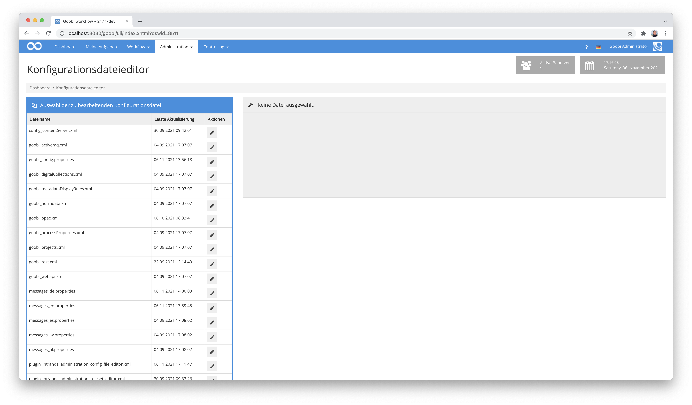
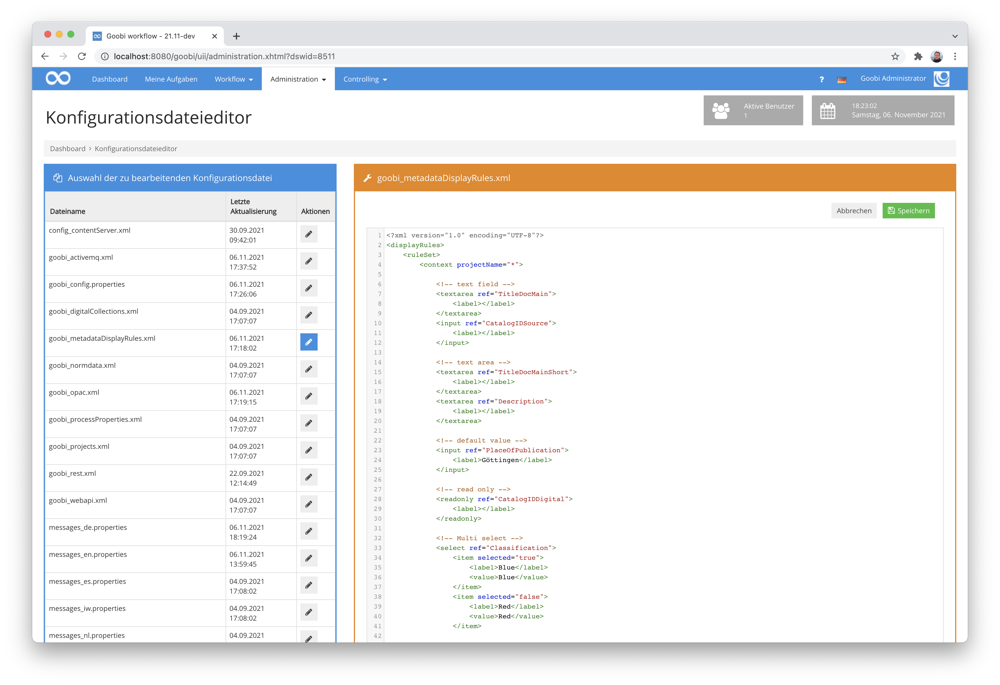
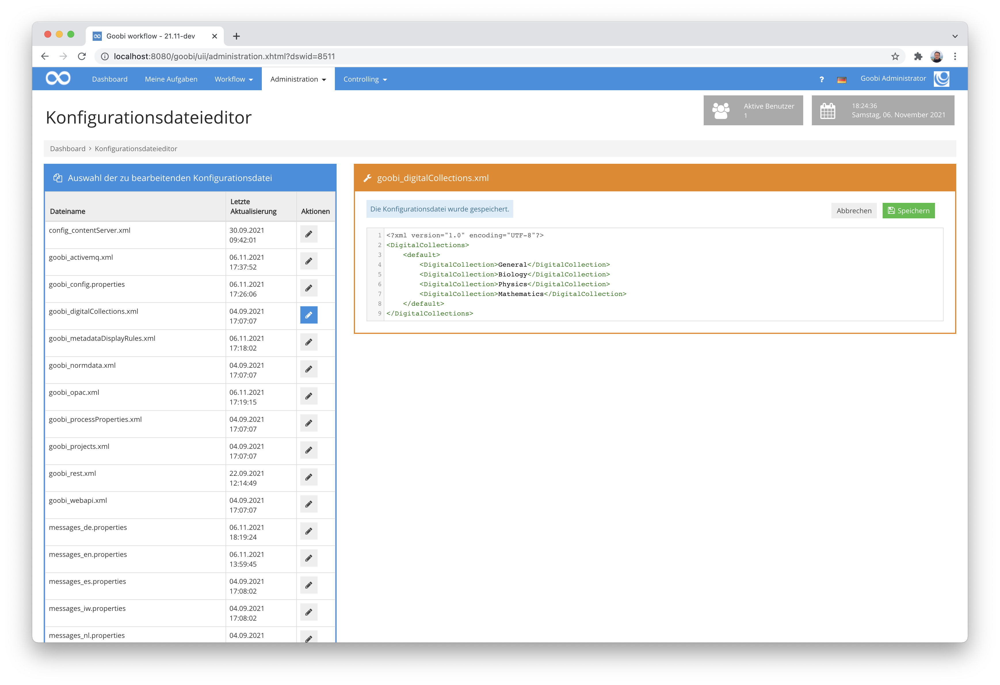

Konfigurationseditor
===========================================================================


Einführung
---------------------------------------------------------------------------
Dieses Plugin dient zur direkten Bearbeitung der verschiedenen Konfigurationsdateien von Goobi workflow direkt aus der Benutzeroberfläche innerhalb des Webbrowsers.


Übersicht
---------------------------------------------------------------------------

Details             |  Erläuterung
------------------- | -----------------------------------------------------
Identifier          | intranda_administration_config_file_editor
Source code         | [https://github.com/intranda/goobi-plugin-administration-config-file-editor](https://github.com/intranda/goobi-plugin-administration-config-file-editor)
Lizenz              | GPL 2.0 oder neuer 
Dokumentationsdatum | 06.11.2021


Arbeitsweise des Plugins
---------------------------------------------------------------------------

Nach der Installation ist das Plugin in einem eigenen Eintrag im Menü `Administration` zu finden, von wo es geöffnet werden kann.



Nach dem Öffnen werden auf der linken Seite alle Konfigurationsdateien von Goobi aufgelistet. Diese kann man durch Anklicken des jeweiligen Icons öffnen, um sie zu bearbeiten.



Öffnet man eine Datei, erscheint auf der rechten Seite ein Texteditor, in dem die Datei bearbeitet werden kann. Bearbeitet und speichert man eine Datei, wird im definierten Backupverzeichnis automatisch ein Backup angelegt. 



Entsprechend des eingestellten Wertes in der Konfigurationsdatei bleibt hier eine gewisse Anzahl an älteren Backups erhalten, bevor diese durch neuere ersetzt werden.


Wurde eine Datei verändert und wird ohne zuvor zu speichern ein Wechsel zu einer anderen Datei versucht, bekommt der Beareiter eine Rückfrage, wie mit den Änderungen zu verfahren ist.


Innerhalb von Goobi können für Konfigurationsdateien Hilfetexte definiert werden, die für die Bearbeitung in diesem Editor behilflich sein können. Die hinterlegten Hilfetexte werden dabei abhängig von der derzeit geöffneten Datei im linken Bereich angezeigt und verfügen auch über die Möglichkeit, dass hier mit Formatierungen gearbeitet wird.


Installation
---------------------------------------------------------------------------
Das Plugin besteht insgesamt aus den folgenden zu installierenden Dateien:

```text
plugin_intranda_administration_config_file_editor.jar
plugin_intranda_administration_config_file_editor-GUI.jar
plugin_intranda_administration_config_file_editor.xml
```

Diese Dateien müssen in den richtigen Verzeichnissen installiert werden, so dass diese nach der Installation unter den folgenden Pfaden vorliegen:

```bash
/opt/digiverso/goobi/plugins/administration/plugin_intranda_administration_config_file_editor.jar
/opt/digiverso/goobi/plugins/GUI/plugin_intranda_administration_config_file_editor-GUI.jar
/opt/digiverso/goobi/config/plugin_intranda_administration_config_file_editor.xml
```


Konfiguration
---------------------------------------------------------------------------
Die Konfiguration des Plugins erfolgt über die Konfigurationsdatei `plugin_intranda_administration_config_file_editor.xml` und kann im laufenden Betrieb angepasst werden. Im folgenden ist eine beispielhafte Konfigurationsdatei aufgeführt:

```xml
<config_plugin>

	<configFileDirectory>/opt/digiverso/goobi/config/</configFileDirectory>
	<!-- By editing a config file in the browser GUI, a backup file will be stored in the backup directory -->
	<configFileBackupDirectory>/opt/digiverso/goobi/config/backup/</configFileBackupDirectory>
	<!-- backup files will be stored as config.xml.1, config.xml.2, ..., config.xml.n -->
	<numberOfBackupFiles>8</numberOfBackupFiles>

</config_plugin>
```

Die Parameter innerhalb dieser Konfigurationsdatei haben folgende Bedeutungen:

Parameter           |  Erläuterung
------------------- | ----------------------------------------------------- 
`configFileDirectory`         | Dies ist der Pfad, an dem sich die Konfigurationsdateien befinden.
`configFileBackupDirectory`   | Hiermit wird der Pfad für die Backup-Dateien festgelegt, wo nach dem Bearbeiten die Backups der Konfigurationsdateien gespeichert werden sollen.
`numberOfBackupFiles`         | Dieser ganzzahlige Wert gibt an, wie viele Backup-Dateien pro Konfigurationsdatei gespeichert bleiben, bevor sie durch neue Backups überschrieben werden.


Einrichtung benötigter Berechtigungen
---------------------------------------------------------------------------
Dieses Plugin verfügt über eine eigene Berechtigungsstufe für die Verwendung. Aus diesem Grund müssen Nutzer über die erforderlichen Rechte verfügen. 


Bitte weisen Sie daher der Benutzergruppe der entsprechenden Nutzer das folgende Recht zu:

```
Plugin_administration_config_file_editor
```

