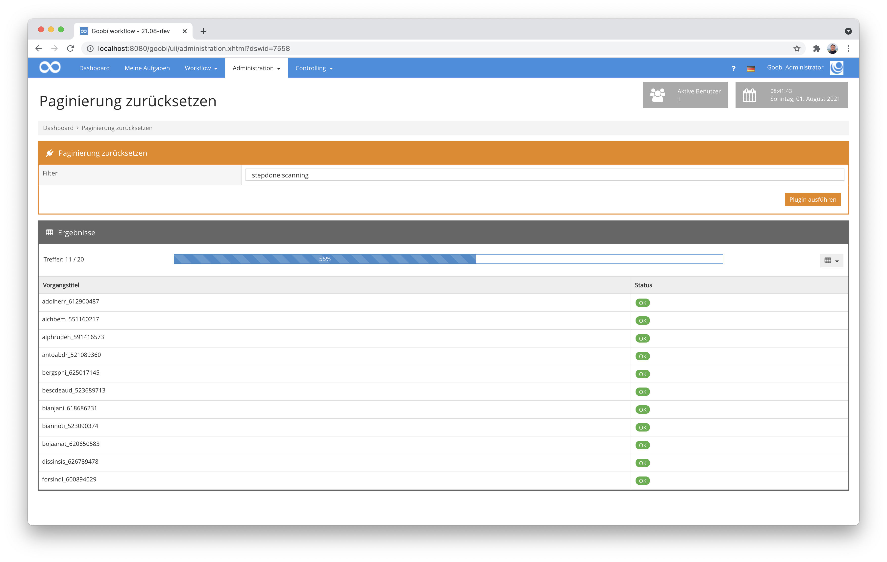

# Paginierung zurücksetzen

## Einführung

Die vorliegende Dokumentation beschreibt die Installation, die Konfiguration und den Einsatz des Administration Plugins für das automatisierte Zurücksetzen der Paginierung innerhalb einer großen Anzahl an Vorgängen innerhalb von Goobi workflow.

| Details |  |
| :--- | :--- |
| Identifier | intranda\_administration\_reset_pagination |
| Source code | [https://github.com/intranda/goobi-plugin-administration-reset-pagination](https://github.com/intranda/goobi-plugin-administration-reset-pagination) |
| Lizenz | GPL 2.0 oder neuer |
| Kompatibilität | Goobi workflow 2021.08 |
| Dokumentationsdatum | 11.09.2021 |

## Installation

Das Plugin besteht insgesamt aus den folgenden zu installierenden Dateien:

```text
plugin_intranda_administration_reset_pagination.jar
plugin_intranda_administration_reset_pagination-GUI.jar
plugin_intranda_administration_reset_pagination.xml
```

Diese Dateien müssen in den richtigen Verzeichnissen installiert werden, so dass diese nach der Installation in folgenden Pfaden vorliegen:

```bash
/opt/digiverso/goobi/plugins/administration/plugin_intranda_administration_reset_pagination.jar
/opt/digiverso/goobi/plugins/GUI/plugin_intranda_administration_reset_pagination-GUI.jar
/opt/digiverso/goobi/config/plugin_intranda_administration_reset_pagination.xml
```

## Konfiguration

Die Konfiguration des Plugins erfolgt über die Konfigurationsdatei `plugin_intranda_administration_reset_pagination.xml` und kann im laufenden Betrieb angepasst werden. Im folgenden ist eine beispielhafte Konfigurationsdatei aufgeführt:

```markup
<?xml version="1.0" encoding="UTF-8"?>
<config_plugin>
	
	<!-- default filter to use -->
	<filter>stepdone:export</filter>
	
</config_plugin>
```

| Parameter | Erläuterung |
| :--- | :--- |
| `filter` | Mit diesem Parameter kann ein Filter als Standard festgelegt werden. Dieser wird beim Betreten des Plugins automatisch vorausgefüllt, kann dann aber je nach Wunsch bei jeder Verwendung des Plugins innerhalb der Nutzeroberfläche angepasst werden. |

Für eine Nutzung dieses Plugins muss der Nutzer über die korrekte Rollenberechtigung verfügen. Bitte weisen Sie daher der Benutzergruppe die Rolle `Plugin_administration_reset_pagination` zu.


## Bedienung des Plugins

Wenn das Plugin korrekt installiert und konfiguriert wurde, ist es innerhalb des Menüpunkts `Administration` zu finden. Nach dem Betreten können in der Oberfläche die oben beschriebenen Parameter noch einmal individuell angepasst werden.



Nach dem Klick auf den Button `Plugin ausführen` startet die Aktualisierung der METS-Dateien. Ein Fortschrittsbalken informiert über den Fortschritt. Innerhalb der Tabelle werden die bereits verarbeiteten Vorgänge aufgelistet und der jeweilige Status über den Erfolg der Durchführung angezeigt.