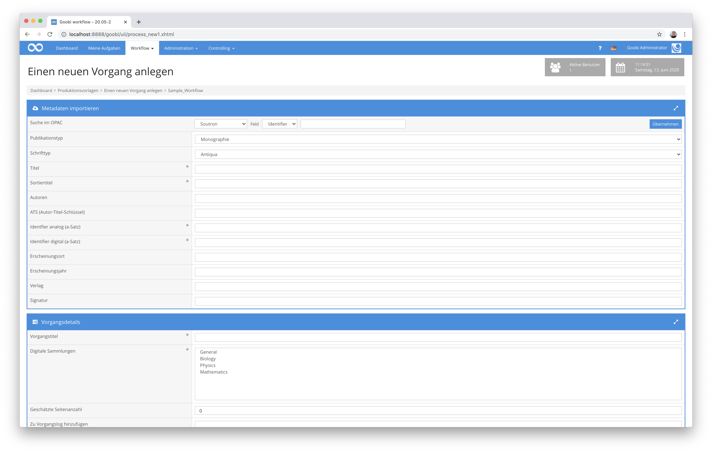

# Soutron Import

## Einführung

Die vorliegende Dokumentation beschreibt die Installation, Konfiguration und den Einsatz des Plugins. Mit Hilfe dieses Plugins können Daten aus einem Soutron-System abgefragt und in Goobi übernommen werden. Hierfür muss der Zugriff auf den Soutron-Katalog gewährleistet sein.

| Details |  |
| :--- | :--- |
| Identifier | intranda\_opac\_soutron |
| Source code | [https://github.com/intranda/goobi-plugin-opac-soutron](https://github.com/intranda/goobi-plugin-opac-soutron) |
| Lizenz | GPL 2.0 oder neuer |
| Kompatibilität | 2020.05 |
| Dokumentationsdatum | ​13.06.2020 |

## Installation

Das Plugin besteht aus zwei Dateien:

```bash
plugin_intranda_opac_soutron.jar
plugin_intranda_opac_soutron.xml
```

Die Datei `plugin_intranda_opac_soutron.jar` enthält die Programmlogik und muss für den Nutzer `tomcat` lesbar an folgendem Pfad installiert werden:

```bash
/opt/digiverso/goobi/plugins/opac/plugin_intranda_opac_soutron.jar
```

Die Datei `plugin_intranda_opac_soutron.xml` muss ebenfalls für den Nutzer `tomcat` lesbar sein und unter folgendem Pfad liegen:

```bash
/opt/digiverso/goobi/config/plugin_intranda_opac_soutron.xml
```

## Konfiguration

Die Konfiguration des Plugins erfolgt in den folgenden Dateien, die sich im Verzeichnis `/opt/digiverso/goobi/config/` befinden.

```bash
goobi_opac.xml
plugin_intranda_opac_soutron.xml
```

In der Datei `goobi_opac.xml` muss die Schnittstelle zum gewünschten Katalogsystem bekannt gemacht werden. Dies geschieht durch einen Eintrag, der wie folgt aussieht:

```markup
<catalogue title="Soutron">
    <config description="Soutron Library System"
      address="https://example.com/Library/WebServices/SoutronAPI.svc/GetCatalogue"
      port="443" database="x" iktlist="x" ucnf="x" opacType="plugin_intranda_opac_soutron" />
    <searchFields>
        <searchField label="Identifier" value="12"/>
    </searchFields>
</catalogue>
```

Das Attribut `title` enthält den Namen, unter dem der Katalog in der Nutzeroberfläche ausgewählt werden kann, `address` die URL zum GetCatalogue-Endpoint und `opacType` das zu nutzende Plugin. In diesem Fall muss der Eintrag `plugin_intranda_opac_soutron` lauten.

Es ist nur eine Suche nach einem Identifier möglich, daher können die anderen Suchoptionen ausgeblendet werden. Dies geschieht innerhalb des `<searchFields>` Blocks.

Das Mapping der Inhalte des Soutron Datensatzes zu den Metadaten in Goobi geschieht in der Datei `plugin_intranda_opac_soutron.xml`:

```markup
<config_plugin>
    <docstructs>
        <docstruct soutron="Item" ruleset="Item" />
        <docstruct soutron="File" ruleset="Item" />
        <docstruct soutron="Book" ruleset="Monograph" />
        <docstruct soutron="Photo" ruleset="Picture" />
    </docstructs>

    <metadata>
        <element xpath="./cat/fs/f[@name='Title']/vs/v[@seq='1']/text()" metadata="TitleDocMain" />
        <element xpath="./cat/fs/f[@name='ISBN']/vs/v/text()" metadata="ISBN" />
        <element xpath="./cat/fs/f[@name='Notes']/vs/v/text()" metadata="Note" />
        <element xpath="./cat/fs/f[@name='Publisher']/vs/v/text()" metadata="PublisherName" />
        <element xpath="./cat/fs/f[@name='Language']/vs/v/text()" metadata="DocLanguage" />
        <element xpath="./cat/fs/f[@name='Subjects']/vs/v/text()" metadata="Subject" />
        <element xpath="./cat/fs/f[@name='Abstract']/vs/v/text()" metadata="Abstract" />
        <element xpath="./cat/fs/f[@name='Date of Publication']/vs/v/text()" metadata="PublicationYear" />
        <element xpath="./cat/fs/f[@name='Place of Publication']/vs/v/text()" metadata="PlaceOfPublication" />
    </metadata>

    <person>
        <element xpath="./cat/fs/f[@name='Author']/vs/v/text()" metadata="Author" />
        <element xpath="./cat/fs/f[@name='Photographer']/vs/v/text()" metadata="Photographer" />
        <element xpath="./cat/fs/f[@name='Translator']/vs/v/text()" metadata="Translator" />
    </person>

</config_plugin>
```

Im Bereich `<docstructs>` wird das Mapping der einzelnen Dokumententypen festgelegt. Für jeden Wert, der in soutron vorkommen kann, muss ein `<docstruct>` existieren. Im Attribut `soutron` wird der Name eingetragen, der im soutron record enthalten ist, in `ruleset` steht das entsprechende Strukturelement aus dem Regelsatz.

Anschließend wird das Mapping für Personen und Metadaten in `<metadata>` und `<person>` konfiguriert. Hier gibt es jeweils eine Liste von `<element>` mit den beiden Attributen `xpath` und `metadata`. In `xpath` wird ein XPath-Ausdruck konfiguriert, der beschreibt, in welchem Teil des XML-Dokuments der Inhalt erwartet wird, in `metadata` wird der Name des Metadatums definiert, in das der Inhalt anschließend geschrieben werden soll.

## Nutzung

Wenn in Goobi nach einem Identifier gesucht wird, wird im Hintergrund eine Anfrage an die konfigurierte URL gestellt:

```bash
https://example.com/Library/WebServices/SoutronAPI.svc/GetCatalogue?id=[VALUE]
```



Sofern hier ein gültiger Datensatz gefunden wird, wird der Datensatz nach dem Feld `/soutron/catalogs_view/ct/cat/rt/@name` durchsucht. Der Wert wird mit der konfigurierten `<docstructs>` Liste verglichen. Wenn es eine Entsprechung gibt, wird das gewünschte Strukturelement erzeugt.

Im Anschluß werden die konfigurierten XPath-Ausdrücke ausgewertet, die für `<metadata>` und `<person>` konfiguriert wurden.

Die Ausdrücke gelten für das Element `/soutron/catalogs_view/ct/`. Sofern mit einem Ausdruck Daten gefunden werden, wird das entsprechend angegebene Metadatum erzeugt. Bei Personen wird geprüft, ob der Wert ein Komma enthält. In dem Fall werden Vor- und Nachname am Komma getrennt, ansonsten wird der Wert als Nachname interpretiert.
