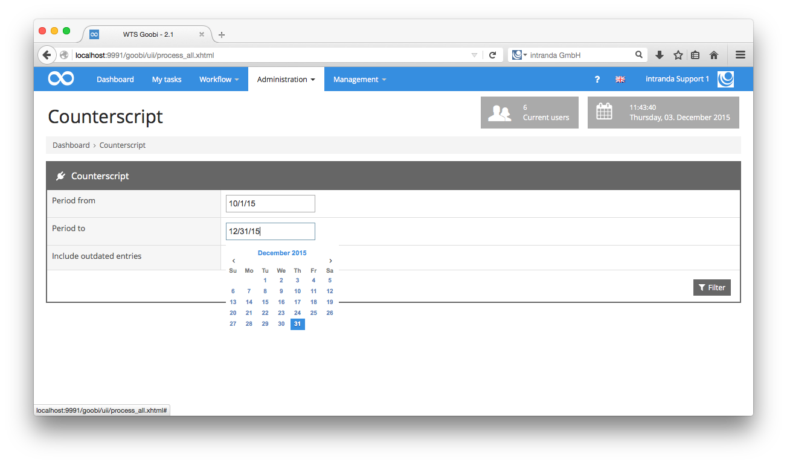
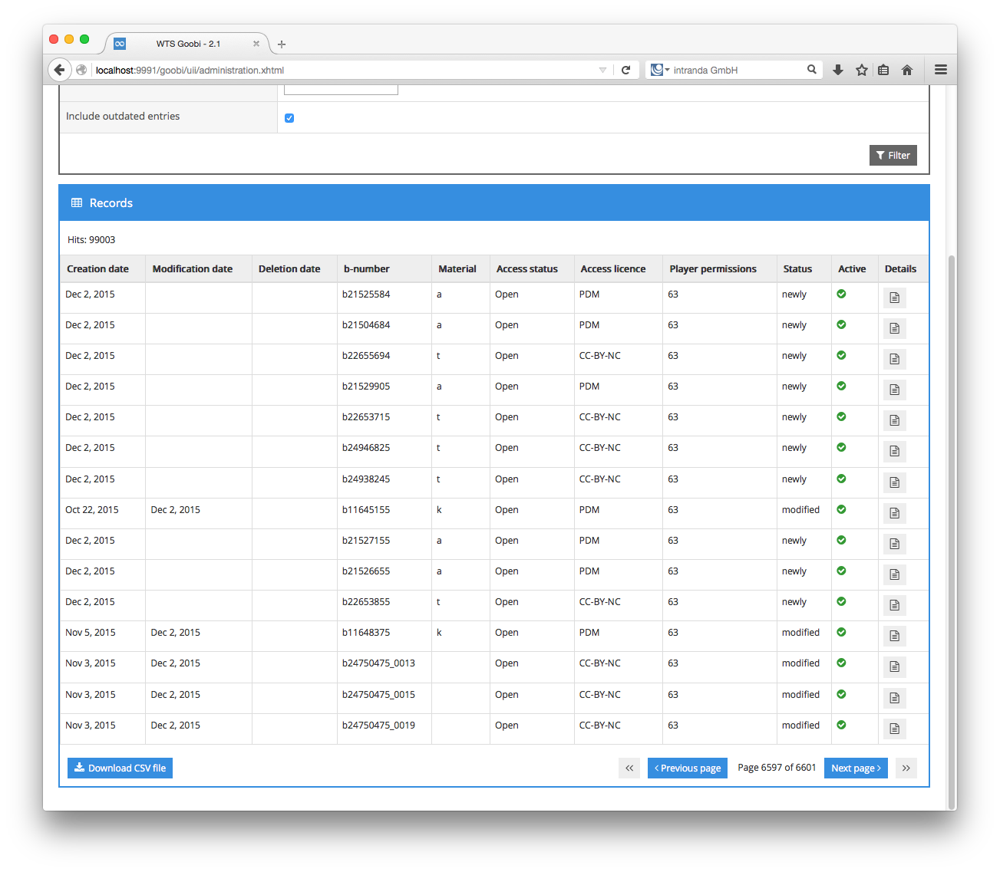
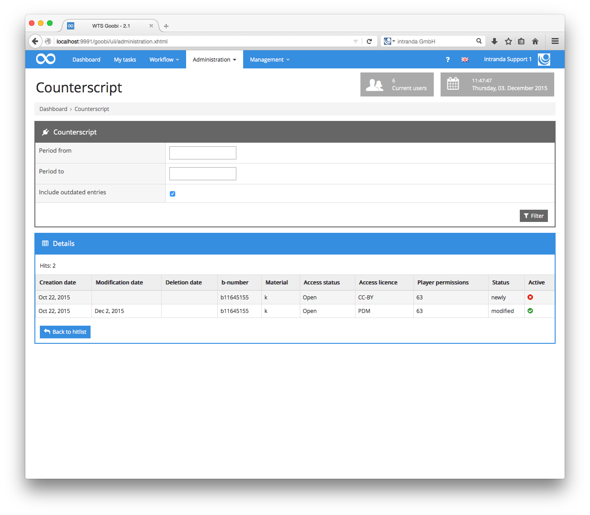

# Counterscript Application

## 1. Einleitung

Das vorliegende Dokument beschreibt die Installation, Konfiguration und den Einsatz der neuen Counterscript Application. Sie besteht aus zwei Teilen, dem `Counterscript Application Server` und dem als Goobi Plugin realisierten `Counterscript Client`.

## 2.  Counterscript Application Server

Der erste Teil der Entwicklungen ist der Counterscript Application Server. Bei ihm handelt es sich um eine eigenständige Java-Web-Applikation, die im bereits installierten Apache-Tomcat-Server installiert wird. Auf dessen Daten kann mit Hilfe der `RESTful API` zugegriffen werden.

### 2.1. Überblick

Mit dieser Applikation können Änderungen an den aus Goobi exportierten METS-Dateien nachvollzogen werden. Dazu wird das Netzlaufwerk des Wellcome Players mit den exportierten METS-Dateien regelmäßig nach neu hinzugekommenen, geänderten oder gelöschten METS-Dateien durchsucht und Informationen aus diesen in einer Datenbank gespeichert.

Diese Datenbank kann anschliessend durchsucht und das Ergebnis in den Formaten `xml`, `csv` oder `json` ausgegeben werden.

Zu jeder METS Datei werden innerhalb der Datenbank folgende Informationen gespeichert:

> * Pfad und Name der Datei
> * b-number
> * material code
> * access status
> * access licence
> * access player permission
> * date of creation
> * date of modification
> * date of deletion
> * status of the file

### 2.2. Installation

Die Counterscript Server Application wird unter folgendem Pfad installiert:

```text
/var/lib/tomcat7/webapps/Counterscript.war
```

Damit auf diese Applikation zugegriffen werden kann, muss sie zusätzlich im Apache Webserver freigegeben werden. Diese Freigabe erfolgt in der hier angegebenen Datei:

```text
/etc/apache2/sites-enabled/000-default
```

In dieser müssen folgende Konfigurationszeilen eingefügt werden.

```markup
redirect /Counterscript http://pl-winslow/Counterscript/
<Location /Counterscript/>
     Order allow,deny
     Allow from all
     ProxyPass http://localhost:8080/Counterscript/ timeout=6000 retry=0
     ProxyPassReverse http://localhost:8080/Counterscript/
</Location>
```

Zusätzlich existiert neben der eigentlichen Applikation außerdem einen Cronjob, der täglich um 0:05 die Aktualisierung der Daten startet. Dieser befindet sich unter folgendem Pfad:

```text
/etc/cron.d/intranda-triggerCounterscript
```

### 2.3. Konfiguration

Damit die Daten der Counterscript Application gespeichert werden können, muss eine neue Mysql-Datenbank erzeugt werden. Dies geschieht mit folgenden SQL-Befehlen innerhalb einer geöffneten SQL-Verbindung:

```sql
create database counterscript;
GRANT ALL PRIVILEGES ON counterscript.* TO 'goobi'@'%' WITH GRANT OPTION;

CREATE TABLE `counterscript`.`files` (
    `id` int(10) unsigned NOT NULL AUTO_INCREMENT,
    `filename` varchar(255) DEFAULT NULL,
    `bnumber` varchar(255) DEFAULT NULL,
    `material` varchar(255) DEFAULT NULL,
    `access_status` varchar(255) DEFAULT NULL,
    `access_licence` varchar(255) DEFAULT NULL,
    `player_permission` varchar(255) DEFAULT NULL,
    `status` varchar(255) DEFAULT NULL,
    `creation_date` datetime DEFAULT NULL,
    `modification_date` datetime DEFAULT NULL,
    `deletion_date` datetime DEFAULT NULL,
    `current` boolean DEFAULT false,
    PRIMARY KEY (`id`)
    ) ENGINE = InnoDB DEFAULT CHARACTER SET = utf8;
```

In folgender Datei muss im Anschluss diese Datenbank noch im Apache-Tomcat bekannt gemacht werden:

```text
/var/lib/tomcat7/conf/context.xml
```

Hierfür müssen die hier nachfolgenden Einträge eingefügt werden:

```markup
<Resource auth="Container"
driverClassName="org.mariadb.jdbc.Driver"
removeAbandoned="true"
logAbandoned="true"
maxActive="100"
maxIdle="30"
maxWait="10000"
name="counterscript"
password="PASSWORD"
type="javax.sql.DataSource"
url="jdbc:mariadb://localhost/counterscript?characterEncoding=UTF-8&amp;autoReconnect=true&amp;autoReconnectForPools=true"
username="goobi" />
```

Weitere Einstellungen sind für die Apache-Tomcat-Konfiguration nicht notwendig.

### 2.4. Nutzung

Nachdem der Counterscript Application Server installiert und konfiguriert wurde, steht dem Nutzer eine RESTful API zur Verfügung. Dabei ist im Folgenden zu beachten, dass Datumsangaben für den Zugriff auf die API stets in Form `YYYY-MM-DD` angegeben werden müssen.  
Folgende Aufrufe dienen zur Aktualisierung des Datenbestandes:

```text
wt-winnipeg/Counterscript/api/run
wt-winnipeg/Counterscript/api/run/{date}
```

Wird die URL ohne ein Datum aufgerufen, wird der gesamte Datenbestand analysiert. Da dies sehr zeitaufwändig ist, kann man der URL ein Datum anhängen, um nur die Änderungen zu erfassen, die seit dem angegebenen Datum stattfanden.  
In der Praxis werden die beiden Befehle nicht notwendig sein, da dies bereits automatisch durch Aufruf des Cronjobs täglich um 0:05 geschieht.  
Wenn eine Analyse des Datenbestandes gestartet wurde, wird das Dateisystem nach neuen METS Dateien durchsucht. Wenn eine Datei gefunden wird, die einen neueren Zeitstempel lastModifiedTime hat, als der letzte Durchlauf her ist, handelt es sich um eine neue oder veränderte Datei.  
In dem Fall wird mit der Datenbank abgeglichen, ob die b-Nummer bereits bekannt ist. Ist sie unbekannt, handelt es sich um einen neuen Datensatz, ansonsten um eine Modifikation. Die notwendigen Daten werden dann mittels XPATH-Anfragen aus der METS-Datei geholt und in die Datenbank geschrieben.  
Anschließend werden die Datensätze der einzelnen Ordner mit den in der Datenbank bekannten Datensätzen verglichen. Fehlen im Ordner Dateien, die in der Datenbank noch bekannt sind, so handelt es sich um eine Löschung. Diese Information wird dann ebenfalls in der Datenbank hinzugefügt.  

Folgende Aufrufe dienen zur Suche im Datenbestand:

```text
wt-winnipeg/Counterscript/api/{format}
wt-winnipeg/Counterscript/api/{format}/withincative
wt-winnipeg/Counterscript/api/{format}/{start date}/{end date}
wt-winnipeg/Counterscript/api/{format}/withincative/{start date}/{end date}
```

Es stehen drei verschiedene Formate zur Verfügung, in denen die Ergebnisse geliefert werden können: `xml`, `csv` und `json`.  

Wird lediglich das Format angegeben, dann liefert die API alle aktiven Einträge, die in der Datenbank erfasst sind. Wird auch der Parameter `withincative` an die URL angehängt, so werden zusätzlich auch alle veralteten Einträge ausgeliefert.

Ist man nur an einer Teilmenge interessiert, kann mittels Start- und Enddatum ein Zeitraum angegeben werden. Das Ergebnis enthält dann nur die Datensätze, bei denen es Änderungen in diesem Zeitraum gab.

Ist man ausschließlich an einem einzelnen Datensatz interessiert, können diese Informationen über folgende URL abgefragt werden:

```text
wt-winnipeg/Counterscript/api/xml/bnumber/{number}
```

### 2.5.  Anbindung externer Tools

Externe Tools können am einfachsten über die RESTful API angebunden werden. Sie müssen dafür die Punkt 2.4 aufgelisteten Befehle implementieren. Alternativ steht der Weg über einen MySQL Client zur Verfügung. Dabei gilt es zu beachten, dass der MySQL-Server aus Sicherheitsgründen nur von localhost erreichbar ist.  

Starten lässt sich der der Client mit dem folgenden Befehl auf dem Linux-Terminal:

```bash
mysql
```

Anschließend kann man die Datenbank counterscript auswählen:

```sql
use counterscript;
```

Dort lassen sich alle Tabellen ausgeben:

```sql
show tables;
```

Dies resultiert in der folgenden Antwort des MySQL-Servers:

|  Tables\_in\_counterscript  |
| :--- |
|  files                     |

Die Datenbank verfügt über eine Tabelle files, die die folgende Struktur aufweist:

```sql
describe files;
```

Die Antwort der Datenbank lautet daraufhin folgendermaßen:

|  **Field**            |  **Type**            |  **Null** |  **Key**  |  **Default**  |  **Extra**  |
| :--- | :--- | :--- | :--- | :--- | :--- |
|  id                 |  int\(10\) unsigned  |  NO    |  PRI  |  NULL     |  auto\_increment  |
|  filename           |  varchar\(255\)      |  YES   |  |  NULL     |  |
|  bnumber            |  varchar\(255\)      |  YES   |  |  NULL     |  |
|  material           |  varchar\(255\)      |  YES   |  |  NULL     |  |
|  access\_status      |  varchar\(255\)      |  YES   |  |  NULL     |  |
|  access\_licence     |  varchar\(255\)      |  YES   |  |  NULL     |  |
|  player\_permission  |  varchar\(255\)      |  YES   |  |  NULL     |  |
|  status             |  varchar\(255\)      |  YES   |  |  NULL     |  |
|  creation\_date      |  datetime          |  YES   |  |  NULL     |  |
|  modification\_date  |  datetime          |  YES   |  |  NULL     |  |
|  deletion\_date      |  datetime          |  YES   |  |  NULL     |  |
|  current            |  tinyint\(1\)        |  YES   |  |  0        |  |

Die Tabelle enthält folgenden Inhalt:

```sql
select * from files;
```

Die Antwort der Datenbank lautet beispielhaft folgendermaßen:

| **id**     | **filename**    | **bnumber**      | **material**  | **access\_status**  | **access\_licence**  | **player\_permission**  | **status**   | **creation\_date**     | **modification\_date**    | **deletion\_date**        | **current**  |
| :--- | :--- | :--- | :--- | :--- | :--- | :--- | :--- | :--- | :--- | :--- | :--- |
|  97297  |  /mnt/export/7/4/7/6/b21286747\_2.xml  |  b21286747\_2  |  |  Open           |  PDM             |  63                 |  deleted   |  2015-09-24 14:51:57  |  NULL                 |  2015-11-26 00:16:54  |        1  |
|  98992  |  /mnt/export/9/6/7/5/b21355769.xml    |  b21355769    |  |  Open           |  CC-BY-NC        |  63                 |  modified  |  2015-08-18 22:21:33  |  2015-12-02 16:18:40  |  NULL                 |        1  |
|  99001  |  /mnt/export/x/4/9/4/b2265494x.xml    |  b2265494x    |  t         |  Open           |  CC-BY-NC        |  63                 |  newly     |  2015-12-02 17:34:48  |  NULL                 |  NULL                 |        1   |

### 2.6. Beispielabfragen an die Datenbank

Beispielhaft wurden SQL Queries für folgende Anfragen vorbereitet.

#### 2.6.1. Query 1: New records <a id="H2.6.1.Query1:Newrecords"></a>

Recently created \(‘New’\) open access records, selectable by date range:

```sql
select * from files where status = 'newly' and creation_date > '2015-11-01' and creation_date < '2015-12-01';
```

#### 2.6.2. Query 2: Modified records <a id="H2.6.2.Query2:Modifiedrecords"></a>

Amended records, selectable by date range, where Access conditions \(Status, Licence, and Player\) have been changed or deleted:

```sql
select bnumber, access_status, access_licence, player_permission from files where status = 'modified' and modification_date > '2015-11-01' and modification_date < '2015-12-01';
```

#### 2.6.3. Query 3: Deleted records <a id="H2.6.3.Query3:Deletedrecords"></a>

Deleted records, selectable by ‘Deleted date’ range:

```sql
select bnumber from files where status = 'deleted' and deletion_date > '2015-11-01' and deletion_date < '2015-12-01';
```

## 3. Goobi Counterscript Plugin

Der zweite Teil der Entwicklungen wurde als Goobi Administration Plugin realisiert. Auf die Weise konnte auf die bereits vorhandene Gestaltung der Oberfläche und die Authentifizierung zurück gegriffen werden.

### 3.1. Installation

Das Goobi Plugin besteht aus folgenden drei Teilen:

```text
/opt/digiverso/goobi/plugins/administration/plugin_intranda_administration_Wellcome.jar
/opt/digiverso/goobi/plugins/GUI/plugin_intranda_administration_Wellcome-GUI.jar
/opt/digiverso/goobi/config/plugin_CounterscriptPlugin.xml
```

Die ersten beiden Dateien enthalten die Programmlogik sowie die graphische Oberfläche. Die Datei `plugin_CounterscriptPlugin.xml` dient zur Konfiguration der RESTful URL und hat folgenden Inhalt:


```markup
<config_plugin>
    <rest_url>http://localhost:8080/Counterscript/api/</rest_url>
</config_plugin>
```


### 3.2. Nutzung

Nachdem das Plugin installiert und eingerichtet wurde, steht es den Nutzern im Bereich des Menüs unter `Administration` zur Verfügung.


Nachdem die Oberfläche geladen wurde, können Startdatum und Enddatum ausgewählt oder direkt über den kompletten Zeitraum gefiltert werden. Optional lassen sich auch veraltete Einträge anzeigen.



Nach dem Filtern erhält man die Liste der gefundenen Datensätze für den gewählten Zeitraum.



Durch diese Liste kann man mit Hilfe des Paginators navigieren, oder die vollständige Trefferliste als CSV Datei speichern. Mittels des Buttons in der Spalte Details eines jeden Eintrags lässt sich der Verlauf jeder Datei im Details nachvollziehen. Hier können alle erfassten Revisionen einer Datei eingesehen werden.


