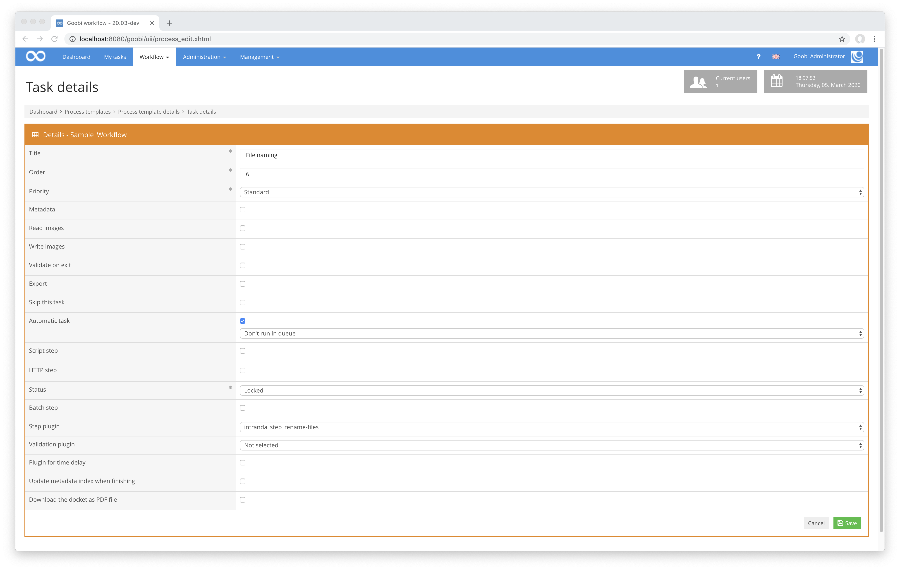

# Umbenennung von Dateien

## Einführung

Dieses Plugin dient zu bedingen Umbenennung von Dateien innerhalb der verschiedenen Ordner eines Vorgangs von Goobi workflow. Die Benennung erfolgt dabei abhängig von einer Konfigurationsdatei, die für unterschiedliche Workflows jeweils anders aufgebaut sein kann.

## Übersicht

| Details |  |
| :--- | :--- |
| Version des Plugins | 1.0.0 |
| Identifier | intranda\_step\_rename-files |
| Source code | - Source code not yet publicly available - |
| Kompatibilität | Goobi workflow 2020.02 |
| Dokumentation vom | 04.03.2020 |

## Installation

Zur Installation des Plugins muss die folgende Datei installiert werden:

```bash
/opt/digiverso/goobi/plugins/workflow/plugin_intranda_step_rename-files.jar
```

Um zu konfigurieren, wie sich das Plugin verhalten soll, können verschiedene Werte in der Konfigurationsdatei angepasst werden. Die Konfigurationsdatei befindet sich üblicherweise hier:

```bash
/opt/digiverso/goobi/config/plugin_intranda_step_rename-files.xml
```

Dabei sieht der Inhalt dieser Konfigurationsdatei beispielhaft wie folgt aus:

```markup
<config_plugin>
    
    <config>
        <project>Monographs 1900-1950</project>
        <project>Monographs 1950-2000</project>
        <step>Automatic renaming</step>
        <namepart type="counter">00000</namepart>
        <namepart type="static">-</namepart>
        <namepart type="variable">{projectid}</namepart>
    </config>
    
    <config>
        <project>*</project>
        <step>*</step>
        <namepart type="variable">{processtitle}</namepart>
        <namepart type="static">_</namepart>
        <namepart type="counter">00000</namepart>
    </config>
    
</config_plugin>
```

## Allgemeine Konfiguration des Plugins

Die Konfiguration des Plugins erfolgt innerhalb der bereits erwähnten Konfigurationsdatei. Dort können verschiedene Parameter konfiguriert werden. Der Block `<config>` kann für verschiedene Projekte oder Arbeitsschritte wiederholt vorkommen, um innerhalb verschiedener Workflows unterschiedliche Aktionen durchführen zu können. Die Elemente `<namepart>` sind hierbei maßgeblich für die Generierung der Dateinamen.

<table>
  <thead>
    <tr>
      <th style="text-align:left">Wert</th>
      <th style="text-align:left">Beschreibung</th>
    </tr>
  </thead>
  <tbody>
    <tr>
      <td style="text-align:left"><code>project</code>
      </td>
      <td style="text-align:left">Dieser Parameter legt fest, f&#xFC;r welches Projekt der aktuelle Block <code>&lt;config&gt;</code> gelten
        soll. Verwendet wird hierbei der Name des Projektes. Dieser Parameter kann
        mehrfach pro <code>&lt;config&gt;</code> Block vorkommen.</td>
    </tr>
    <tr>
      <td style="text-align:left"><code>step</code>
      </td>
      <td style="text-align:left">Dieser Parameter steuert, f&#xFC;r welche Arbeitsschritte der Block &lt;config&gt;
        gelten soll. Verwendet wird hier der Name des Arbeitsschritts. Dieser Parameter
        kann mehrfach pro <code>&lt;config&gt;</code> Block vorkommen.</td>
    </tr>
    <tr>
      <td style="text-align:left"><code>namepart</code>
      </td>
      <td style="text-align:left">
        <p>Dieser ebenfalls mehrfach verwendbare Parameter steuert die Generierung
          der Dateinamen. Er kann statische Elemente beinhalten (<code>static</code>),
          Variablen aus Goobi nutzen (<code>variable</code>) sowie einen Z&#xE4;hler
          erzeugen (<code>counter</code>). F&#xFC;r die Generierung des Z&#xE4;hlers
          ist entscheidend, welche Anzahl an Stellen definiert wurden. Der Wert <code>00000</code> w&#xFC;rde
          beispielsweise f&#xFC;nfstellige Zahlen mit ggf. vorangestellten Nullen
          erzeugen.</p>
        <p>Die so definierten Bestandteile des Dateinamens werden f&#xFC;r die Benennung
          miteinander verkettet und anschlie&#xDF;end um die eigentliche Dateiendung
          erg&#xE4;nzt, um so die Datei zu benennen.</p>
      </td>
    </tr>
  </tbody>
</table>## Arbeitsweise

Das Plugin wird üblicherweise vollautomatisch innerhalb des Workflows ausgeführt. Es ermittelt zunächst, ob sich innerhalb der Konfigurationsdatei ein Block befindet, der für den aktuellen Workflow bzgl. des Projektnamens und Arbeitsschrittes konfiguriert wurde. Wenn dies der Fall ist, werden die einzelnen Elemente `<namepart>` ausgewertet, mit den entsprechenden Werten für den Zähler und die Variablen aus Goobi workflow ausgestattet und anschließend miteinander verkettet. Die somit erzeugten Dateinamen werden nun für sämtliche relevanten Verzeichnisse des Goobi Vorgangs angewendet und mit den jeweils korrekten Dateinamenerweiterungen ergänzt \(z.B. `.tif`\).

Sollte innerhalb des Dateien eine Datei vorgefunden werden, die `barcode` innerhalb des Dateinamens enthält, so wird diese ebenfalls entsprechend des Namensschemas benannt. Als Zähler wird hier jedoch der Wert `0` gesetzt.

Details über die in diesem Plugin verwendbaren Variablen aus Goobi workflow finden sich[ innerhalb dieser Dokumentation](https://docs.intranda.com/goobi-workflow-de/manager/8).

Das Plugin berücksichtigt für die Benennung die Dateien innerhalb der folgenden Unterverzeichnisse:

* master
* media
* jpeg
* alto
* pdf
* txt
* xml

## Bedienung des Plugins

Dieses Plugin wird in den Workflow so integriert, dass es automatisch ausgeführt wird. Eine manuelle Interaktion mit dem Plugin ist nicht notwendig. Zur Verwendung innerhalb eines Arbeitsschrittes des Workflows sollte es wie im nachfolgenden Screenshot konfiguriert werden.



