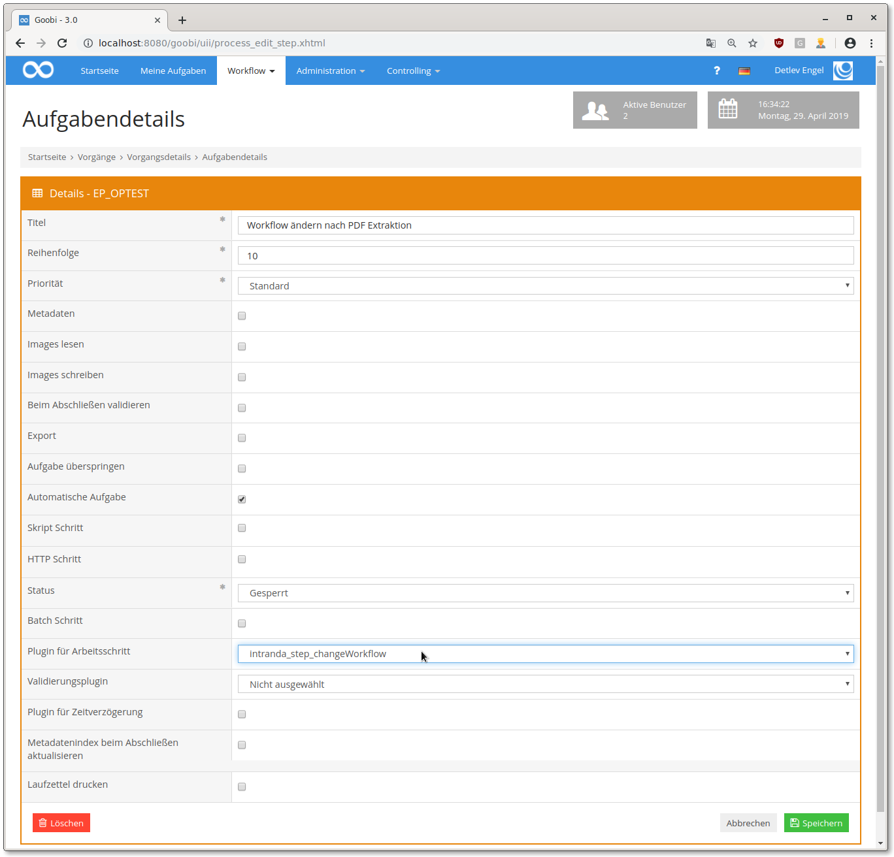

# Ändern des Workflows auf Grundlage von Vorgangseigenschaften

## Einführung

Die vorliegende Dokumentation beschreibt die Installation, Konfiguration und den Einsatz eines Plugins zum automatischen Ändern von Workflows zur Laufzeit. Das Plugin kann \(je nach Konfiguration\) Schritte öffnen, schließen oder deaktivieren. Die Entscheidung, was geschehen soll, wird auf Grundlage von Vorgangseigenschaften getroffen.

| Details |  |
| :--- | :--- |
| Identifier | intranda\_step\_changeWorkflow |
| Source code | [https://github.com/intranda/goobi-plugin-step-change-workflow](https://github.com/intranda/goobi-plugin-step-change-workflow) |
| Lizenz | GPL 2.0 oder neuer |
| Kompatibilität | Goobi workflow 2021.03 |
| Dokumentationsdatum | 27.04.2021 |

## Voraussetzung

Voraussetzung für die Verwendung des Plugins ist der Einsatz von Goobi workflow in Version 3.0.0 oder höher, die korrekte Installation und Konfiguration des Plugins sowie die korrekte Einbindung des Plugins in die gewünschten Arbeitsschritte des Workflows.

## Installation und Konfiguration

Zur Nutzung des Plugins muss es an folgenden Ort kopiert werden:

```text
/opt/digiverso/goobi/plugins/step/plugin_intranda_step_changeWorkflow.jar
```

Die Konfiguration des Plugins wird unter folgendem Pfad erwartet:

```text
/opt/digiverso/goobi/config/plugin_intranda_step_changeWorkflow.xml
```

Es folgt eine kommentierte Beispielkonfiguration:

```markup
<config_plugin>
    <!--
        order of configuration is: 
        1.) project name and step name matches 
        2.) step name matches and project is * 
        3.) project name matches and step name is * 
        4.) project name and step name are * 
    -->

    <config>
        <!-- which projects to use for (can be more then one, otherwise use *) -->
        <project>Register</project>
        <step>Check</step>

        <!-- multiple changes can be done within one configuration rule; simply add another 'change' element with other properties here -->
        <change>
            <!-- name of the property or metadata to check: please take care to use the syntax of the Variable replacer here -->
            <propertyName>{process.TemplateID}</propertyName>
            <!-- expected value (can be blank too) -->
            <propertyValue>183</propertyValue>
            <!-- condition for value comparing, can be 'is' or 'not' or 'missing' or 'available' -->
            <propertyCondition>is</propertyCondition>
            <!-- list of steps to open, if property value matches -->
            <steps type="open">
                <title>Box preparation</title>
            </steps>
            <!-- list of steps to deactivate -->
            <steps type="deactivate">
                <title>Image QA</title>
            </steps>
            <!-- list of steps to close -->
            <steps type="close">
                <title>Automatic LayoutWizzard Cropping</title>
                <title>LayoutWizzard: Manual confirmation</title>
            </steps>
            <!-- list of steps to lock -->
            <steps type="lock">
                <title>Automatic export to Islandora</title>
            </steps>

            <usergroups step="Image QA">
                <usergroup>Administration</usergroup>
                <usergroup>AutomaticTasks</usergroup>
            </usergroups>
        </change>
    </config>

    <config>
        <!-- which projects to use for (can be more then one, otherwise use *) -->
        <project>*</project>
        <step>*</step>

        <!-- multiple changes can be done within one configuration rule; simply add another 'change' element with other properties here -->
        <change>
            <!-- name of the property or metadata to check: please take care to use the syntax of the Variable replacer here -->
            <propertyName>{process.upload to digitool}</propertyName>
            <!-- expected value (can be blank too) -->
            <propertyValue>No</propertyValue>
            <!-- condition for value comparing, can be 'is' or 'not' -->
            <propertyCondition>is</propertyCondition>
            <!-- list of steps to open, if property value matches -->
            <steps type="open">
                <title>Create derivates</title>
                <title>Jpeg 2000 generation and validation</title>
            </steps>
            <!-- list of steps to deactivate -->
            <steps type="deactivate">
                <title>Rename files</title>
            </steps>
            <!-- list of steps to close -->
            <steps type="close">
                <title>Upload raw tiffs to uploaddirectory Socrates</title>
                <title>Automatic pagination</title>
            </steps>
            <!-- list of steps to lock -->
            <steps type="lock">
                <title>Create METS file</title>
                <title>Ingest into DigiTool</title>
            </steps>
        </change>
    </config>

</config_plugin>
```

Jeder `<config>`-Block ist hier für ein bestimmtes Projekt und einen bestimmten Schritt verantwortlich, wobei auch die Wildcard `*` und Mehrfachnennungen von Prozessen bzw. Schritten möglich sind. Wenn im Workflow also ein Schritt mit diesem Plugin ausgeführt wird, wird nach einem `<config>`-Block gesucht, der zum gerade geöffneten Schritt passt. Wenn zum Beispiel im Projekt "PDF Digitalisierung" der Schritt mit Titel "Workflow ändern nach PDF Extraktion" mit diesem Plugin konfiguriert und ausgeführt wird, sucht das Plugin einen `<config>`-Block der folgendermaßen aussieht:

```markup
<config>
    <project>PDF Digitalisierung</project>
    <step>Workflow ändern nach PDF Extraktion</step>
    [...]
</config>
```

In jedem `<change>`-Element wird dann konfiguriert, welche Prozesseigenschaft überprüft wird \(`<propertyName>`\) und welcher Wert erwartet wird \(`<propertyValue>`\). Alle folgenden `<step>`-Elemente beschreiben dann eine Aktion, die ausgeführt wird, wenn die vorher konfigurierte Eigenschaft dem erwarteten Wert entspricht. Schritte können geöffnet `type="open"`, deaktiviert `type="deactivate"`, geschlossen `type="close"` und gesperrt `type="lock"` werden.

Bitte beachten Sie, dass die Angabe zur Definition, welche Eigenschaft für die Prüfung eines Wertes verwendet werden soll, mit der Syntax für den sog. Variablen Replacer angegeben werden muss. Entsprechend muss bei der Definition des Feldes, das geprüft werden soll die Angabe wir wie in in folgenden Beispielen erfolgen:

```markup
<propertyName>{process.ABC}</propertyName>
<propertyName>{{meta.ABC}}</propertyName>
<propertyName>{meta.topstruct.ABC}</propertyName>
<propertyName>{meta.firstchild.ABC}</propertyName>
<propertyName>{db_meta.ABC}</propertyName>
```

Weitere Erläuterungen über die Verwendung von Variablen finden sich hier:



## Einstellungen in Goobi

Nachdem das Plugin installiert und konfiguriert wurde, kann es in der Nutzeroberfläche in einem Workflowschritt konfiguriert werden. Hierbei sollte darauf geachtet werden, dass der Schritt so heißt, wie in der Konfigurationsdatei. Außerdem sollte ein Haken bei `Automatische Aufgabe` gesetzt sein.



## Nutzung

Da das Plugin vollautomatisch laufen sollte, ist für die Nutzung nichts weiter zu beachten.

