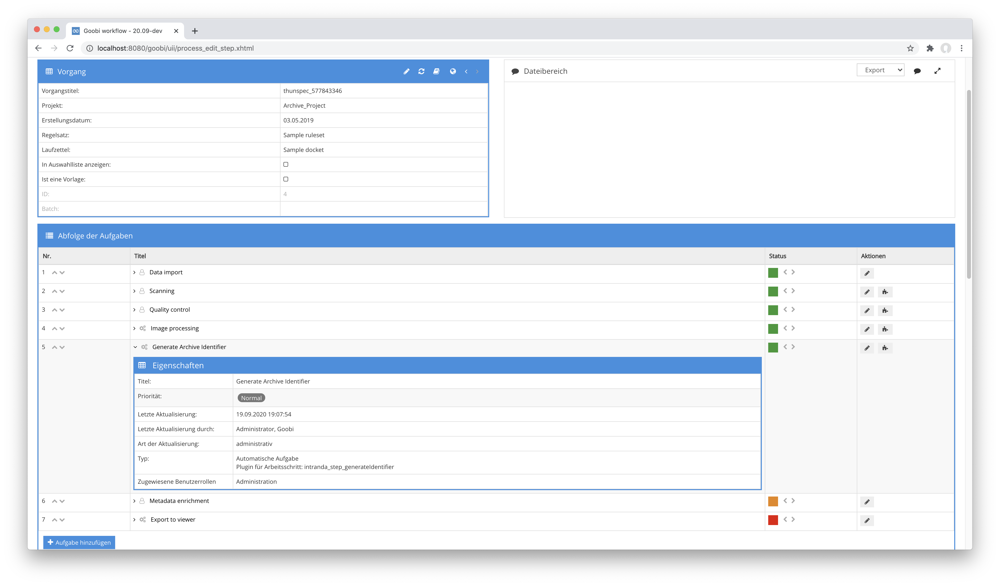

# Identifier generieren

## Einführung

Das Plugin erlaubt eine automatische Generierung von Identifiern und das Speichern innerhalb eines Metadatums in der METS-Datei des entprechdnen Vorgangs.

## Übersicht

| Details |  |
| :--- | :--- |
| Version | 1.0.0 |
| Identifier | intranda\_step\_generateIdentifier |
| Source code | [https://github.com/intranda/goobi-plugin-step-generateIdentifier](https://github.com/intranda/goobi-plugin-step-generateIdentifier) |
| Lizenz | GPL 2.0 oder neuer |
| Kompatibilität | Goobi workflow 2020.09 |
| Dokumentationsdatum | 04.10.2020 |

## Installation

Zur Installation des Plugins muss die folgende Datei installiert werden:

```bash
/opt/digiverso/goobi/plugins/step/plugin_intranda_step_generateIdentifier.jar
```

Um zu konfigurieren, wie sich das Plugin verhalten soll, können verschiedene Werte in der Konfigurationsdatei angepasst werden. Die Konfigurationsdatei befindet sich üblicherweise hier:

```bash
/opt/digiverso/goobi/config/plugin_intranda_step_generateIdentifier.xml
```

## Konfiguration des Plugins

Die Konfiguration des Plugins ist folgendermaßen aufgebaut:

```markup
<config_plugin>

    <config>
        <!-- which projects to use for (can be more then one, otherwise use *) -->
        <project>*</project>
        <step>*</step>

        <!-- into which field shall the new identifier be written -->
        <field>CatalogIDDigital</field>
        <!-- which type of identifier shall be created? Possible values are random, timestamp, uuid -->
        <type>uuid</type>
        <!-- how long shall the new identifier be if it is a numeric one (just in case the type is set to 'random' -->
        <length>9</length>
        <!-- overwrite existing value if it exists already -->
        <overwrite>true</overwrite>
    </config>

</config_plugin>
```

Der Block `<config>` kann für verschiedene Projekte oder Arbeitsschritte wiederholt vorkommen, um innerhalb verschiedener Workflows unterschiedliche Aktionen durchführen zu können. Die weiteren Parameter innerhalb dieser Konfigurationsdatei haben folgende Bedeutungen:

| Wert | Beschreibung |
| :--- | :--- |
| `project` | Dieser Parameter legt fest, für welches Projekt der aktuelle Block `<config>` gelten soll. Verwendet wird hierbei der Name des Projektes. Dieser Parameter kann mehrfach pro `<config>` Block vorkommen. |
| `step` | Dieser Parameter steuert, für welche Arbeitsschritte der Block `<config>` gelten soll. Verwendet wird hier der Name des Arbeitsschritts. Dieser Parameter kann mehrfach pro `<config>` Block vorkommen. |
| `field` | Mit diesem Parameter kann festgelegt werden, in welches Metadatenfeld der generierte Identifier geschrieben werden soll. |
| `type` | Dieser Parameter erlaubt zwischen verschiedenen Typen für die Generierung des Identifiers auszuwählen. Zur Verfügung stehen Zufallszahlen (`random`), Zeitstempel (`timestamp`) sowie UUIDs (`uuid`). |
| `length` | Wurde als Typ eine Zufallszahl ausgewählt, so kann hier die Anzahl der Stellen festgelegt werden. |
| `overwrite` | Wenn dieser Parameter auf `true` gesetzt wird, so wird bei wiederholter Ausführung des Plugins stets ein neuer Identifier erzeugt und überschreibt damit einen eventuell vorhandenen Identifier erneut. Andernfalls (`false`) würde nur dann ein neuer Identifier erzeugt werden, wenn das konfigurierte Feld (`field`) noch leer ist oder nicht existiert. |

## Integration des Plugins in den Workflow

Zur Inbetriebnahme des Plugins muss dieses für einen oder mehrere gewünschte Aufgaben im Workflow aktiviert werden. Dies erfolgt wie im folgenden Screenshot aufgezeigt durch Auswahl des Plugins `intranda_step_generateIdentifier` aus der Liste der installierten Plugins.



Da dieses Plugin üblicherweise automatisch ausgeführt werden soll, sollte der Arbeitsschritt im Workflow als automatisch konfiguriert werden.

## Arbeitsweise des Plugins

Nachdem das Plugin vollständig installiert und eingerichtet wurde, wird es üblicherweise automatisch innerhalb des Workflows ausgeführt, so dass keine manuelle Interaktion mit dem Nutzer erfolgt. Stattdessen erfolgt der Aufruf des Plugins durch den Workflow im Hintergrund und startet die Generierung eines Identifiers abhängig von der gewählten Konfiguration.
