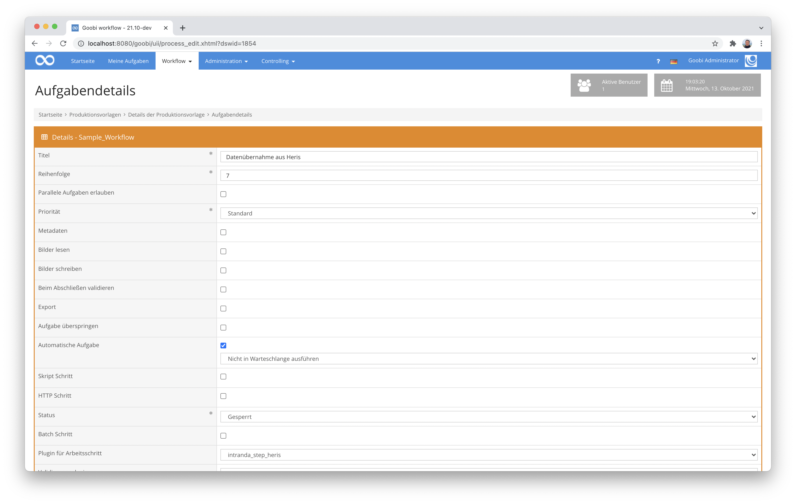

Heris Datenimport
===========================================================================


Einführung
---------------------------------------------------------------------------
Dieses Plugin erlaubt die Datenübername von mehreren Metdaten aus einem Vokabular in METS-Dateien. Es wurde spezifisch für das Bundesdenkmalamt in Österreich entwickelt, so dass die Metadaten des Vokabulars sehr individuell und hard-gecoded sind. Sie stammen ursprünglich aus der sogenannten HERIS-Datenbank, die innerhalb von Goobi workflow als eigenes Vokabular importiert wurde.


Übersicht
---------------------------------------------------------------------------

Details             |  &nbsp;
------------------- | -----------------------------------------------------
Identifier          | intranda_step_herisimport
Source code         | [https://github.com/intranda/goobi-plugin-step-herisimport](https://github.com/intranda/goobi-plugin-step-herisimport)
Lizenz              | GPL 2.0 oder neuer 
Dokumentationsdatum | 13.10.2021


Installation
---------------------------------------------------------------------------
Das Plugin besteht insgesamt aus den folgenden zu installierenden Dateien:

```text
goobi_plugin_step_herisimport.jar
```

Diese Datei mus in dem folgenden Verzeichnis installiert werden:

```bash
/opt/digiverso/goobi/plugins/step/goobi_plugin_step_herisimport.jar
```


Konfiguration
---------------------------------------------------------------------------
Eine eigenständige Konfiguration des Plugins erfolgt nicht, da die zu importierenden Metadaten hard-gecoded wurden.


Integration des Plugins in den Workflow
---------------------------------------------------------------------------
Zur Inbetriebnahme des Plugins muss dieses für einen oder mehrere gewünschte Aufgaben im Workflow aktiviert werden. Dies erfolgt wie im folgenden Screenshot aufgezeigt durch Auswahl des Plugins `intranda_step_herisimport` aus der Liste der installierten Plugins.



Da dieses Plugin üblicherweise automatisch ausgeführt werden soll, sollte der Arbeitsschritt im Workflow als `automatisch` konfiguriert werden.


Arbeitsweise des Plugins
---------------------------------------------------------------------------
Nachdem das Plugin vollständig installiert und eingerichtet wurde, wird es üblicherweise automatisch innerhalb des Workflows ausgeführt, so dass keine manuelle Interaktion mit dem Nutzer erfolgt. Stattdessen erfolgt der Aufruf des Plugins durch den Workflow im Hintergrund und führt die folgenden Arbeiten durch: 

Das Plugin durchsucht die METS-Datei nach einem Metdatum mit dem Namen `HerisID` und importiert im Anschluß eine Liste verschiedener Metadaten aus dem Heris-Vokabular. Das Mapping der Metadaten umfasst dabei die folgende Liste:

Metadatum Heris                                | Metadatum METS
-----------------------------------------------|------------------------
`Alte Objekt-ID`                               | `DMDBID`
`Gehört zu alter Objekt-ID`                    | `ParentElement`
`Katalogtitel`                                 | `TitleDocMain`
`Typ`                                          | `HerisType`
`Hauptkategorie grob`                          | `MainCategory1`
`Hauptkategorie mittel`                        | `MainCategory2`
`Hauptkategorie fein`                          | `MainCategory3`
`Gemeinden politisch (lt. Katastralgemeinden)` | `PoliticalCommunity`
`Katastralgemeinde`                            | `CadastralCommune`
`Bezirk`                                       | `PoliticalDistrict`
`Bundesland`                                   | `FederalState`
`Grundstücksnummern`                           | `PropertyNumber`
`Bauzeit von`                                  | `ConstructionTimeFrom`
`Bauzeit bis`                                  | `ConstructionTimeTo`
`Publiziert`                                   | `Published`
`Straße`                                       | `Street`
`Hausnummer`                                   | `StreetNumber`
`PLZ`                                          | `ZIPCode`
`Zusatztext aus Adresse`                       | `AdditionalAddressText`
`Weitere Adressen`                             | `OtherAddress`
`Gehört zu HERIS-ID`                           | `ParentElement`
`Ort`                                          | `Community`
`Staat`                                        | `Country`