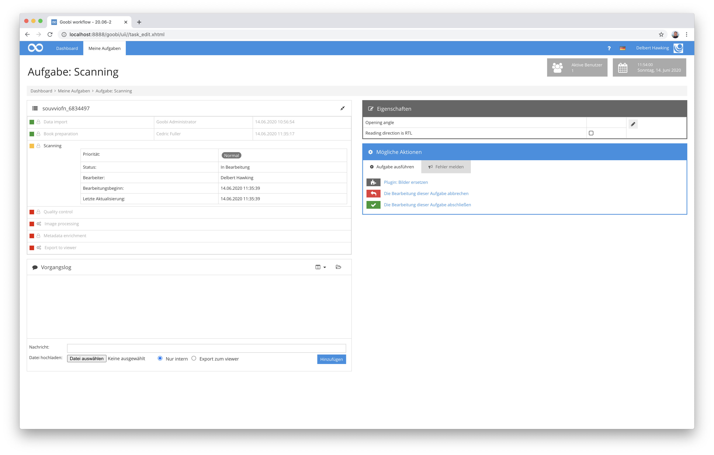
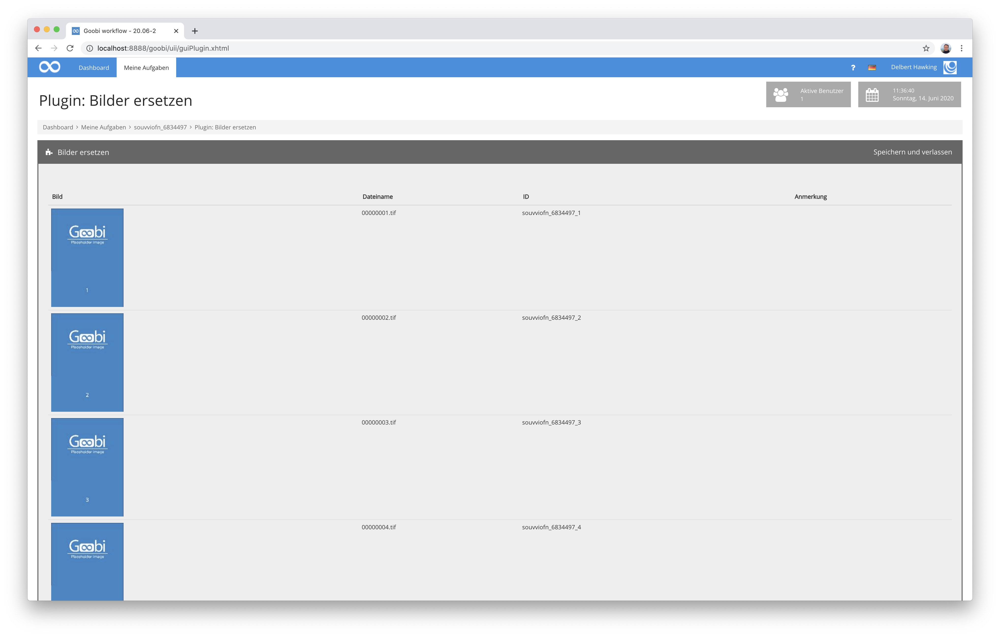

# Ersetzen von Bildern

## Einführung

Dieses Plugin dient zum Ersetzen von zuvor eingespielten Platzhalterbildern innerhalb des Master-Ordners eines Vorgangs von Goobi workflow durch die tatsächlichen Master-Bilder. Die Bedienung des Plugins erfolgt über einfaches Drag & Drop der gewünschten Dateien in die Nutzeroberfläche des Plugins.

| Details |  |
| :--- | :--- |
| Identifier | intranda\_step\_replace-images |
| Source code | [https://github.com/intranda/goobi-plugin-step-replace-images](https://github.com/intranda/goobi-plugin-step-replace-images) |
| Lizenz | GPL 2.0 oder neuer |
| Kompatibilität | Goobi workflow 2020.06 |
| Dokumentationsdatum | 13.06.2020 |

## Installation

Dieses Plugin wird als `tar`-Archiv ausgeliefert. Um es zu installieren, muss das Archiv `plugin_intranda_step_replace-images.tar` in den Goobi-Ordner entpackt werden:

```bash
tar -C /opt/digiverso/goobi/ -xf plugin_intranda_step_replace-images.tar --exclude="pom.xml"
```

Dieses Plugin hat keine Konfigurationsdatei und ist daher nicht konfigurierbar.

## Bedienung des Plugins

Dieses Plugin wird in den Workflow so integriert, dass es für eine ausgewählte Aufgabe zur Verfügung steht. Nach dem Annehmen der Aufgabe, kann der Nutzer das Plugin betreten.



Somit erhält der Nutzer Zugriff auf die Nutzeroberfläche des Plugins, wo ihm der derzeitige Inhalt des Master-Ordners aufgelistet wird. Hier können nun gezielt einzelne oder auch viele Bilder per Drag & Drop an diejenige Stelle kopiert werden, ab der die einzufügenden Bilder die vorhandenen Platzhalterbilder ersetzen sollen. Das Plugin stellt während des Uploads zugleich sicher, dass die neu hochgeladenen Dateien korrekt umbenannt werden.



